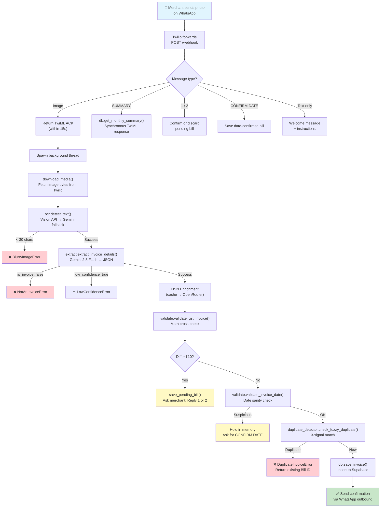
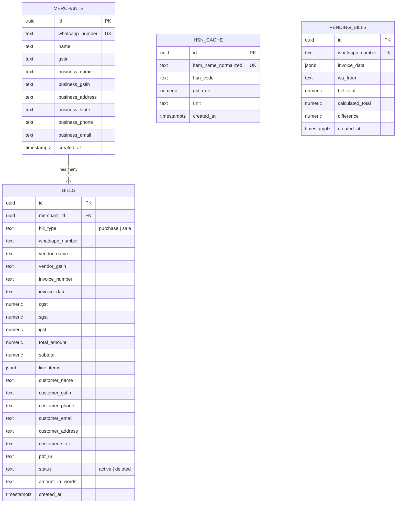

# 🏗️ High-Level Design Architecture — GST ACT AI

> **A production-grade, AI-powered WhatsApp bot that converts photos of GST invoices into structured, validated, accounting-ready database records — with a merchant dashboard and sales invoice generator.**

---

## Table of Contents

1. [System Overview](#1-system-overview)
2. [Architecture Diagram](#2-architecture-diagram)
3. [Component Design](#3-component-design)
4. [Data Flow — Bill Processing Pipeline](#4-data-flow--bill-processing-pipeline)
5. [Data Flow — Invoice Generation Pipeline](#5-data-flow--invoice-generation-pipeline)
6. [Database Schema (ERD)](#6-database-schema-erd)
7. [API Surface](#7-api-surface)
8. [Error Handling & Resilience](#8-error-handling--resilience)
9. [Concurrency Model](#9-concurrency-model)
10. [Caching Strategy](#10-caching-strategy)
11. [Security Considerations](#11-security-considerations)
12. [Deployment Architecture](#12-deployment-architecture)
13. [Key Design Decisions & Trade-offs](#13-key-design-decisions--trade-offs)
14. [Tech Stack Summary](#14-tech-stack-summary)

---

## 1. System Overview

GST ACT AI solves a real problem for small Indian merchants: **manually entering purchase bills into accounting systems is tedious, error-prone, and time-consuming.** This system lets any merchant simply photograph a GST bill on WhatsApp and have it automatically OCR'd, parsed, validated, de-duplicated, and saved — with structured line items, HSN codes, and tax breakdowns.

### Core Capabilities

| Capability | Description |
|---|---|
| **Bill Intake via WhatsApp** | Merchants send bill photos via WhatsApp; the bot processes them end-to-end |
| **Dual OCR Engine** | Google Cloud Vision (primary) with Gemini multimodal fallback |
| **AI-Powered Extraction** | Gemini 2.5 Flash extracts structured JSON from raw OCR text |
| **Mathematical Validation** | Cross-checks line item sums + tax against the stated total |
| **Fuzzy Duplicate Detection** | Prevents re-entry using normalized invoice number, exact amount, and ≥80% vendor name similarity |
| **Date Anomaly Detection** | Flags invoices with dates >1 year old or >30 days in the future |
| **Human-in-the-Loop Confirmation** | Holds suspicious bills in a pending state; merchant confirms via WhatsApp reply |
| **HSN Code Enrichment** | Auto-fills missing HSN/SAC codes via OpenRouter API with Supabase cache |
| **Merchant Dashboard** | Web-based dashboard with OTP login, bill history, and monthly GST summaries |
| **Sales Invoice Generator** | Create, manage, and download GST-compliant sales invoices as PDFs |

---

## 2. Architecture Diagram

```
┌─────────────────────────────────────────────────────────────────────────────┐
│                           EXTERNAL SERVICES                                │
│                                                                             │
│   ┌──────────────┐  ┌──────────────────┐  ┌────────────────┐               │
│   │   Twilio      │  │  Google Cloud    │  │  OpenRouter    │               │
│   │  WhatsApp API │  │  Vision API      │  │  (Gemini Flash)│               │
│   └──────┬───────┘  └────────┬─────────┘  └───────┬────────┘               │
│          │                   │                     │                         │
│   ┌──────┴───────┐  ┌───────┴──────────┐          │                         │
│   │  Twilio SMS  │  │  Google Gemini   │          │                         │
│   │  (OTP)       │  │  2.5 Flash       │          │                         │
│   └──────┬───────┘  └───────┬──────────┘          │                         │
└──────────┼──────────────────┼─────────────────────┼─────────────────────────┘
           │                  │                     │
           ▼                  ▼                     ▼
┌─────────────────────────────────────────────────────────────────────────────┐
│                        FLASK APPLICATION SERVER                            │
│                                                                             │
│  ┌─────────────────┐  ┌──────────────────┐  ┌────────────────────────────┐ │
│  │  app.py         │  │  invoices/       │  │  Static Dashboard          │ │
│  │  ─────────────  │  │  ──────────────  │  │  ───────────────────       │ │
│  │  • /webhook     │  │  • Blueprint     │  │  • dashboard/index.html   │ │
│  │  • /api/bills   │  │  • routes.py     │  │  • dashboard/css/         │ │
│  │  • /api/summary │  │  • services.py   │  │  • dashboard/js/          │ │
│  │  • /api/send-otp│  │  • db_invoices.py│  │                            │ │
│  │  • /api/verify  │  │  • templates/    │  │                            │ │
│  └───────┬─────────┘  └────────┬─────────┘  └────────────────────────────┘ │
│          │                     │                                            │
│  ┌───────┴─────────────────────┴─────────────────────────────────────────┐ │
│  │                     CORE PROCESSING MODULES                           │ │
│  │                                                                       │ │
│  │  ┌──────────┐  ┌────────────┐  ┌──────────────┐  ┌─────────────────┐ │ │
│  │  │  ocr.py  │  │ extract.py │  │ validate.py  │  │ duplicate_      │ │ │
│  │  │          │  │            │  │              │  │ detector.py     │ │ │
│  │  │ Vision + │  │ Gemini AI  │  │ Math check + │  │ Fuzzy matching  │ │ │
│  │  │ Gemini   │  │ JSON parse │  │ Date check   │  │ (3 signals)     │ │ │
│  │  │ fallback │  │ + HSN fill │  │              │  │                 │ │ │
│  │  └──────────┘  └────────────┘  └──────────────┘  └─────────────────┘ │ │
│  │                                                                       │ │
│  │  ┌────────────────┐  ┌────────────────────────────────────────────┐   │ │
│  │  │ exceptions.py  │  │ db.py                                      │   │ │
│  │  │ Custom errors  │  │ Supabase CRUD, merchant mgmt, HSN cache   │   │ │
│  │  └────────────────┘  └────────────────────────────────────────────┘   │ │
│  └───────────────────────────────────────────────────────────────────────┘ │
└──────────────────────────────────────┬──────────────────────────────────────┘
                                       │
                                       ▼
┌─────────────────────────────────────────────────────────────────────────────┐
│                          SUPABASE (PostgreSQL)                              │
│                                                                             │
│   ┌────────────┐  ┌────────────┐  ┌────────────┐  ┌──────────────────────┐│
│   │ merchants  │  │   bills    │  │ hsn_cache  │  │   pending_bills      ││
│   │            │←─│            │  │            │  │   (TTL: 10 min)      ││
│   └────────────┘  └────────────┘  └────────────┘  └──────────────────────┘│
│                                                                             │
│   ┌──────────────────────────────────────────────────────────────────────┐ │
│   │  Supabase Storage — "invoices" bucket (public PDFs)                  │ │
│   └──────────────────────────────────────────────────────────────────────┘ │
└─────────────────────────────────────────────────────────────────────────────┘
```

---

## 3. Component Design

### 3.1 `app.py` — Application Orchestrator (795 lines)

The central Flask application that wires together all components.

**Responsibilities:**
- Twilio WhatsApp webhook handler (`POST /webhook`)
- Background thread pool for async bill processing
- Dashboard REST API (OTP auth, bills, summary, WhatsApp info)
- Human-in-the-loop confirmation flows (math mismatch, date anomaly)
- Static file serving for the merchant dashboard

**Key Design Pattern:** The webhook handler returns an immediate TwiML ACK to Twilio (within 15s deadline), then spawns a `daemon` thread for the heavy OCR → Extract → Validate → Save pipeline. Results are delivered asynchronously via Twilio's outbound WhatsApp API.

```python
# Immediate ACK pattern
threading.Thread(
    target=process_bill_in_background,
    args=(whatsapp_number, media_url, wa_from),
    daemon=True
).start()
return twiml_ack("⏳ Got your bill! Processing now...")
```

### 3.2 `ocr.py` — Dual OCR Engine (144 lines)

**Strategy:** Primary/Fallback pattern for maximum reliability.

```
Image Bytes
    │
    ├──→ Google Cloud Vision API (fast, accurate for printed text)
    │         │
    │         ├── Success → Return raw text
    │         │
    │         └── Failure ──→ Gemini 2.5 Flash Multimodal OCR (fallback)
    │                              │
    │                              ├── Success → Return raw text
    │                              └── Failure → Raise exception
    │
    └──→ Quality Gate: len(text) < 30 chars → BlurryImageError
```

### 3.3 `extract.py` — AI-Powered Structured Extraction (281 lines)

Converts raw OCR text into a clean JSON structure using Gemini 2.5 Flash with `response_mime_type: application/json` for guaranteed JSON output.

**Extracted Fields:**
- `vendor_name`, `vendor_gstin`, `invoice_number`, `invoice_date`
- `cgst`, `sgst`, `igst`, `total_amount`
- `line_items[]` — each with `description`, `hsn_sac`, `quantity`, `rate`, `amount`, `gst_rate`, `gst_amount`
- `is_invoice` — gate to reject non-invoice photos
- `low_confidence` — gate to reject handwritten/carbon copy/ambiguous bills

**HSN Enrichment Layer:** After extraction, each line item is passed through `lookup_hsn_for_item()` which checks the Supabase `hsn_cache` first, then calls OpenRouter (Gemini Flash) on cache miss. Only backfills missing fields — values found on the actual invoice always take priority.

### 3.4 `validate.py` — Mathematical & Date Validation (173 lines)

Two independent validation stages:

| Validation | Logic | Action on Failure |
|---|---|---|
| **Math Check** | `sum(line_items.amount) + CGST + SGST + IGST ≈ total_amount` | If diff > ₹10 → hold in `pending_bills`, ask merchant to confirm |
| **Date Check** | Invoice date within [now - 365d, now + 30d] | Raises `SuspiciousDateError` → hold for CONFIRM DATE reply |

### 3.5 `duplicate_detector.py` — Fuzzy Duplicate Prevention (120 lines)

Three-signal matching (ALL must pass):

```
Signal 1: Invoice Number   → Normalized exact match (strip /\-\s, uppercase)
Signal 2: Total Amount     → Exact numeric match
Signal 3: Vendor Name      → difflib SequenceMatcher ratio > 0.80
```

This handles OCR-induced character errors (e.g., `P` misread as `F` in GSTIN) while maintaining precision — matching on amount prevents false positives.

### 3.6 `exceptions.py` — Domain-Specific Error Hierarchy (69 lines)

```
Exception
├── BlurryImageError          # OCR returned < 30 chars
├── NotAnInvoiceError         # AI classified as non-invoice
├── LowConfidenceError        # Handwritten / carbon copy / ambiguous
├── DuplicateInvoiceError     # Carries existing_bill_id + date
└── SuspiciousDateError       # Carries extracted_date for user review
```

Each exception maps to a specific user-facing WhatsApp message in `app.py`.

### 3.7 `db.py` — Data Access Layer (353 lines)

- **Supabase Client Factory:** Lazy initialization via environment variables
- **Merchant Management:** `get_or_create_merchant()` — auto-provisions merchant on first bill
- **Bill Persistence:** `save_invoice()` — full pipeline: merchant lookup → duplicate check → insert
- **HSN Cache:** Read-through cache (`get_hsn_from_cache` / `save_hsn_to_cache`) with normalized item names
- **Pending Bills:** CRUD operations for the math-validation confirmation flow (10-min TTL with expiry check)
- **Monthly Summary:** Aggregates CGST/SGST/IGST/total across current month's bills

### 3.8 `invoices/` — Sales Invoice Generator Blueprint

A Flask Blueprint providing a complete invoicing sub-system:

| File | Responsibility |
|---|---|
| `__init__.py` | Blueprint registration with template/static folder config |
| `routes.py` | Page rendering + REST API endpoints (create, list, detail, delete, PDF download) |
| `services.py` | PDF generation (ReportLab), HSN lookup, GSTIN validation, Supabase Storage upload |
| `db_invoices.py` | Supabase CRUD for sales invoices, auto-increment invoice numbering, merchant profiles |

### 3.9 `dashboard/` — Merchant Web Dashboard

Static HTML/CSS/JS served by Flask. Features:
- OTP-based phone authentication (via Twilio SMS)
- Bill history with month filtering
- Monthly GST summary with 6-month trend charts
- WhatsApp bot connection QR code

---

## 4. Data Flow — Bill Processing Pipeline



---

## 5. Data Flow — Invoice Generation Pipeline

```mermaid
flowchart LR
    A["Merchant fills\ninvoice form"] --> B["POST /api/invoice"]
    B --> C["Validate inputs\n(GSTIN, items, rates)"]
    C --> D["Auto-generate\ninvoice number"]
    D --> E["save_sales_invoice()\nInsert to Supabase"]
    E --> F["generate_invoice_pdf()\nReportLab → bytes"]
    F --> G["upload_pdf_to_storage()\nSupabase Storage"]
    G --> H["Update bill record\nwith pdf_url"]
    H --> I["Save merchant profile\nfor future use"]
    I --> J["✅ Return bill_id,\ninvoice_number, pdf_url"]

    style A fill:#e1f5fe
    style J fill:#c8e6c9
```



---

## 6. Database Schema (ERD)



**Indexes for query performance:**
- `idx_bills_bill_type` — filter purchase vs. sale bills
- `idx_bills_whatsapp_bill_type` — composite index for merchant bill queries
- `idx_hsn_cache_normalized` — fast HSN cache lookup
- `idx_pending_bills_phone` — unique constraint for one pending bill per merchant

---

## 7. API Surface

### WhatsApp Webhook

| Endpoint | Method | Description |
|---|---|---|
| `POST /webhook` | POST | Twilio WhatsApp webhook — routes images, text commands, and confirmation replies |

### Dashboard Authentication

| Endpoint | Method | Description |
|---|---|---|
| `POST /api/send-otp` | POST | Generate 6-digit OTP, send via Twilio SMS |
| `POST /api/verify-otp` | POST | Verify OTP, return session token |

### Purchase Bill APIs

| Endpoint | Method | Description |
|---|---|---|
| `GET /api/bills` | GET | List merchant's purchase bills (filterable by month) |
| `GET /api/bills/<id>` | GET | Single bill with full line_items detail |
| `GET /api/summary` | GET | Current month summary + 6-month trend data |
| `GET /api/whatsapp-info` | GET | Bot's WhatsApp number + wa.me link for QR |

### Sales Invoice APIs

| Endpoint | Method | Description |
|---|---|---|
| `POST /api/invoice` | POST | Create sales invoice → generate PDF → upload to storage |
| `GET /api/invoices` | GET | List sales invoices (searchable, filterable by status) |
| `GET /api/invoice/<id>` | GET | Full invoice detail including pdf_url |
| `DELETE /api/invoice/<id>` | DELETE | Soft-delete invoice (status → 'deleted') |
| `GET /api/next-invoice-number` | GET | Auto-generated next invoice number |
| `GET /api/hsn-lookup` | POST | HSN/SAC code lookup with cache |
| `GET /api/merchant-profile` | GET | Fetch saved merchant business profile |
| `POST /api/merchant-profile` | POST | Update merchant business profile |

### Pages

| Endpoint | Method | Description |
|---|---|---|
| `GET /` | GET | Health check / status |
| `GET /dashboard/` | GET | Merchant dashboard SPA |
| `GET /new-invoice` | GET | Invoice creation form |
| `GET /invoices` | GET | Invoice history page |
| `GET /invoice/<id>` | GET | Invoice detail view |
| `GET /invoice/pdf/<id>` | GET | PDF download / redirect |

---

## 8. Error Handling & Resilience

### Exception-to-User-Message Mapping

Every pipeline error maps to a specific, actionable WhatsApp message:

```
BlurryImageError      → "📷 Photo Too Blurry — retry with better lighting"
NotAnInvoiceError     → "🚫 Not a GST Bill — send a valid invoice"
LowConfidenceError    → "⚠️ Unable to process — upload clearer image"
DuplicateInvoiceError → "ℹ️ Duplicate Invoice — already recorded as Bill ID: ..."
SuspiciousDateError   → "⚠️ Date Verification Required — reply CONFIRM DATE"
Math Mismatch (>₹10)  → "⚠️ Total Mismatch — reply 1 to confirm, 2 to discard"
Generic Exception     → "❌ Processing Failed — ensure clear photo of GST bill"
```

### Resilience Patterns

| Pattern | Implementation |
|---|---|
| **OCR Fallback** | Vision API failure → Gemini multimodal OCR |
| **Quality Gate** | Reject images with < 30 chars of OCR text |
| **AI Confidence Gate** | Gemini self-reports `low_confidence` for ambiguous bills |
| **Graceful Degradation** | HSN lookup failures are non-fatal (returns null, pipeline continues) |
| **TTL Expiry** | Pending bills auto-expire after 10 minutes |
| **Transaction Rollback** | If PDF generation fails after invoice save, the saved record is deleted |
| **Chunked Messaging** | Item-wise GST details split into 1500-char chunks to avoid WhatsApp message limits |

---

## 9. Concurrency Model

```
Main Thread (Flask/Gunicorn)
    │
    ├── POST /webhook received
    │       │
    │       ├── SUMMARY command → Synchronous response (fast DB query)
    │       │
    │       └── Image upload → Immediate TwiML ACK
    │               │
    │               └── threading.Thread(daemon=True)
    │                       │
    │                       └── process_bill_in_background()
    │                               ├── download_media()     ~2-5s
    │                               ├── detect_text()        ~3-8s
    │                               ├── extract_invoice()    ~5-10s
    │                               ├── validate()           ~instant
    │                               ├── duplicate_check()    ~1-2s
    │                               ├── save_invoice()       ~1-2s
    │                               └── send_whatsapp()      ~1-2s
    │                                   Total: ~15-30s
    │
    └── Twilio receives ACK < 15s ✓
```

**Why daemon threads?** Twilio's webhook requires a response within 15 seconds. The full OCR + AI pipeline takes 15-30 seconds. Daemon threads die automatically when the main process exits, preventing zombie threads.

**Production consideration:** For multi-worker Gunicorn deployments, the in-memory `_otp_store` and `_pending_bills` dictionaries should be replaced with Redis. The database-backed `pending_bills` table already handles the math-validation flow correctly across workers.

---

## 10. Caching Strategy

### HSN Code Cache (Supabase `hsn_cache` table)

```
Item Description → normalize(lowercase, strip punctuation, collapse spaces)
                       │
                       ├── Cache HIT → Return {hsn_code, gst_rate, unit} instantly
                       │
                       └── Cache MISS → Call OpenRouter API (Gemini Flash)
                                           │
                                           └── Save result to hsn_cache (upsert)
                                               └── Return {hsn_code, gst_rate, unit}
```

- **Normalization:** `"Gurjan Plywood 18mm"` → `"gurjan plywood 18mm"`
- **Persistence:** Database-backed, survives server restarts
- **Conflict handling:** Upsert on `item_name_normalized` with fallback insert (tolerates missing UNIQUE constraint)

### Summary Query Optimization

The `/api/summary` endpoint fetches 6 months of bills in a **single Supabase query** and processes monthly aggregation in-memory, reducing latency from 6 round-trips to 1.

---

## 11. Security Considerations

| Area | Implementation |
|---|---|
| **API Authentication** | OTP-based phone verification for dashboard access |
| **Bill Access Control** | All bill queries scoped by `whatsapp_number` |
| **GSTIN Validation** | Regex + checksum validation on invoice creation |
| **Input Sanitization** | Phone numbers normalized to E.164 format |
| **Media Download Auth** | Twilio media fetched with account SID + auth token |
| **CORS** | Restricted to `/api/*` routes with configurable origins |
| **Soft Delete** | Invoices are soft-deleted (status → 'deleted'), never hard-deleted |
| **Secrets Management** | All credentials loaded from `.env` via python-dotenv |

---

## 12. Deployment Architecture

```
┌──────────────────────────────────────────────────────────┐
│                    Azure App Service                      │
│                                                          │
│   ┌──────────────────────────────────────────────────┐   │
│   │  Gunicorn (2 workers, 120s timeout)              │   │
│   │  └── Flask Application                           │   │
│   │       ├── WhatsApp Webhook Handler               │   │
│   │       ├── Dashboard API                          │   │
│   │       ├── Invoice Generator Blueprint            │   │
│   │       └── Background Processing Threads          │   │
│   └──────────────────────────────────────────────────┘   │
│                                                          │
│   startup.sh:                                            │
│   gunicorn --bind=0.0.0.0:8000 --timeout 120             │
│            --workers 2 app:app                           │
└──────────────────────────────────────────────────────────┘
         │              │               │
         ▼              ▼               ▼
    Supabase       Twilio          Google Cloud
    (DB + Storage) (WhatsApp/SMS)  (Vision + Gemini)
```

---

## 13. Key Design Decisions & Trade-offs

### ✅ Decision: Background Threads over Celery/Redis Queue

**Rationale:** Twilio requires webhook response within 15s. A full task queue (Celery) adds infrastructure complexity for a single-worker deployment. Python's `threading.Thread` with `daemon=True` provides sufficient concurrency for the current scale.

**Trade-off:** Background threads don't survive process restarts. A queued job (Redis/Celery) would retry on failure. For now, the user can simply re-send the photo.

### ✅ Decision: Dual OCR (Vision API + Gemini Fallback)

**Rationale:** Google Cloud Vision is faster and more accurate for printed text, but requires a separate API key and billing. Gemini's multimodal OCR provides a zero-cost fallback using the same API key as extraction.

### ✅ Decision: Fuzzy Duplicate Detection (3-Signal Match)

**Rationale:** Simple exact-match on invoice number fails because OCR introduces character errors. Using normalized invoice number + exact amount + vendor name similarity (>80%) provides high precision with tolerance for OCR noise.

**Why not content hashing?** Different photos of the same bill produce different hashes. The 3-signal approach is content-aware, not pixel-aware.

### ✅ Decision: Math Mismatch Threshold = ₹10

**Rationale:** Indian bills frequently include freight charges, packing charges, and rounding adjustments that aren't captured as line items. A ₹10 tolerance prevents constant false-positive flagging while catching genuine OCR errors.

### ✅ Decision: Database-Backed HSN Cache

**Rationale:** OpenRouter API calls cost money and add latency (~2-5s per item). Merchants typically deal with 20-50 recurring product types. Caching HSN lookups by normalized item name eliminates 90%+ of API calls after the first few bills.

### ✅ Decision: Human-in-the-Loop for Edge Cases

**Rationale:** Instead of silently saving potentially incorrect data or silently rejecting valid bills, the system holds suspicious bills (date anomalies, math mismatches) and asks the merchant to confirm. This balances automation with data accuracy.

---

## 14. Tech Stack Summary

| Layer | Technology | Purpose |
|---|---|---|
| **Runtime** | Python 3.11+ | Core application language |
| **Web Framework** | Flask 3.1 | HTTP routing, webhook handling, API |
| **WSGI Server** | Gunicorn 23.0 | Production server (Azure App Service) |
| **Primary OCR** | Google Cloud Vision API | Text extraction from bill images |
| **Fallback OCR** | Gemini 2.5 Flash (multimodal) | Image-to-text when Vision fails |
| **AI Extraction** | Gemini 2.5 Flash (text) | OCR text → structured JSON |
| **HSN Lookup** | OpenRouter API (Gemini Flash) | Item name → HSN code + GST rate |
| **Messaging** | Twilio WhatsApp + SMS API | Bot messaging + OTP delivery |
| **Database** | Supabase (PostgreSQL) | Bills, merchants, HSN cache, pending bills |
| **Object Storage** | Supabase Storage | Invoice PDFs |
| **PDF Generation** | ReportLab 4.1 | GST-compliant invoice PDFs |
| **Image Processing** | Pillow 12.2 | Image format handling for Gemini OCR |
| **Deployment** | Azure App Service | Cloud hosting |

---

## 📂 Repository Structure

```
GST_ACT_AI/
├── app.py                    # Flask app — webhook + dashboard API
├── ocr.py                    # Dual OCR engine (Vision + Gemini)
├── extract.py                # AI extraction + HSN enrichment
├── validate.py               # Math validation + date checks
├── duplicate_detector.py     # Fuzzy 3-signal duplicate detection
├── exceptions.py             # Domain-specific error hierarchy
├── db.py                     # Supabase data access layer
├── migration.sql             # Database schema + indexes
├── requirements.txt          # Python dependencies
├── startup.sh                # Gunicorn launch script (Azure)
│
├── invoices/                 # Sales Invoice Generator Blueprint
│   ├── __init__.py           # Blueprint registration
│   ├── routes.py             # Page + API routes
│   ├── services.py           # PDF generation, HSN, GSTIN validation
│   ├── db_invoices.py        # Invoice-specific DB operations
│   ├── templates/            # Jinja2 templates (forms, history, detail)
│   └── static/               # Blueprint-specific CSS/JS
│
├── dashboard/                # Merchant Dashboard (static SPA)
│   ├── index.html            # Main dashboard page
│   ├── css/                  # Stylesheets
│   └── js/                   # Client-side JavaScript
│
├── tests/                    # Test suite
│   ├── test_date_validation.py
│   ├── test_duplicate_detector.py
│   ├── test_hsn_cache.py
│   ├── test_gemini.py
│   ├── test_supabase.py
│   ├── test_twilio.py
│   └── test_vision.py
│
└── ARCHITECTURE.md           # ← You are here
```
