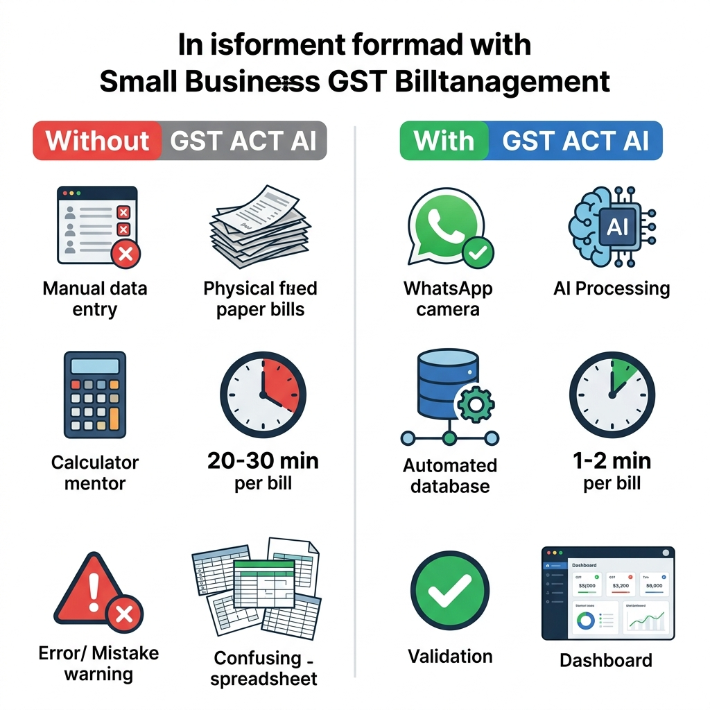
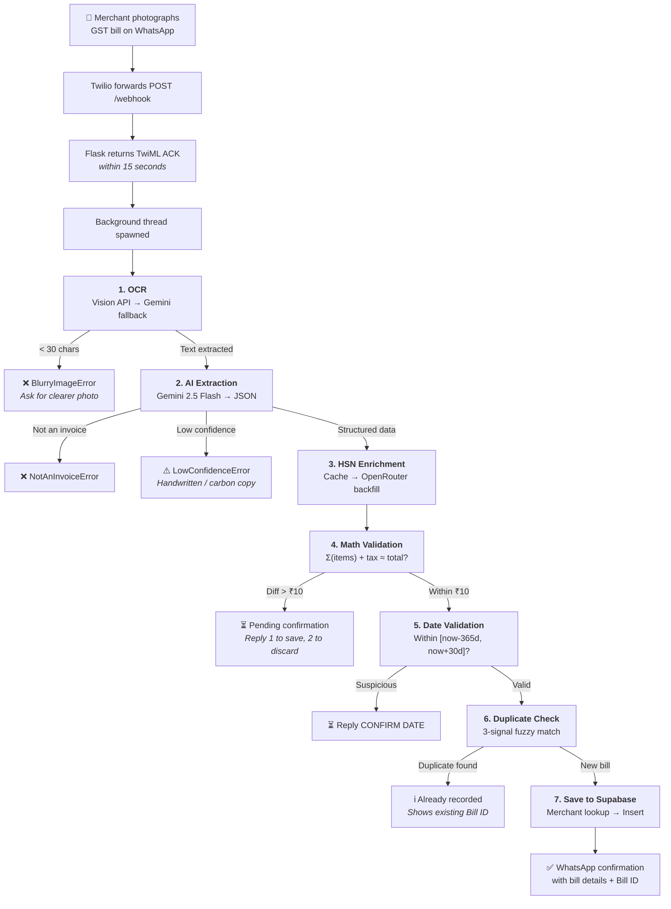
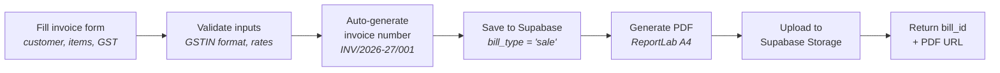
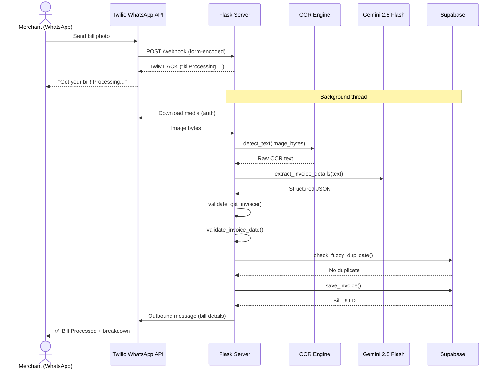
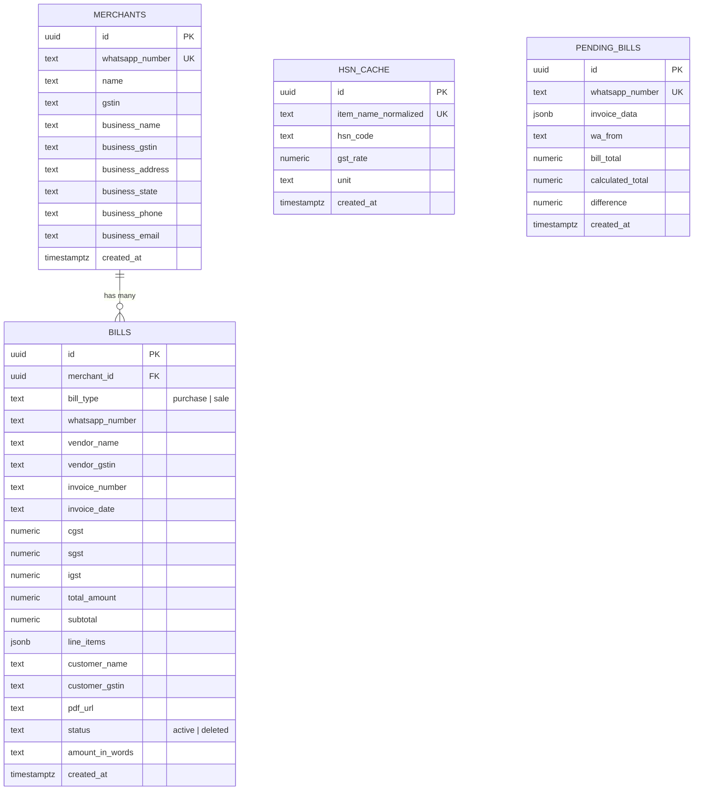

<p align="center">
  
</p>

<h1 align="center">GST ACT AI</h1>

<p align="center">
  <strong>Photograph a GST bill on WhatsApp. Get structured, validated, accounting-ready records in seconds.</strong>
</p>

<p align="center">
  
  
  
  
  
  
  
</p>

<p align="center">
  <a href="#-quick-start">Quick Start</a> · 
  <a href="#-end-to-end-workflow">Workflow</a> · 
  <a href="#-architecture">Architecture</a> · 
  <a href="#-api-reference">API Reference</a> · 
  <a href="ARCHITECTURE.md">Full HLD →</a>
</p>

---

## Table of Contents

- [What GST ACT AI does](#-what-gst-act-ai-does)
- [Why it exists](#-why-it-exists)
- [Key capabilities](#-key-capabilities)
- [End-to-end workflow](#-end-to-end-workflow)
- [GST automation](#-gst-automation)
- [WhatsApp integration](#-whatsapp-integration)
- [Architecture](#-architecture)
- [Data model](#-data-model)
- [Quick start](#-quick-start)
- [Configuration reference](#-configuration-reference)
- [API reference](#-api-reference)
- [Security and privacy](#-security-and-privacy)
- [Reliability and error handling](#-reliability-and-error-handling)
- [Testing](#-testing)
- [Deployment](#-deployment)
- [Repository structure](#-repository-structure)
- [Current scope and limitations](#-current-scope-and-limitations)
- [Roadmap](#-roadmap)
- [Troubleshooting](#-troubleshooting)
- [Contributing](#-contributing)
- [License](#-license)

---

## 📋 What GST ACT AI does

GST ACT AI is an AI-powered WhatsApp bot and web dashboard that automates the intake, parsing, validation, and storage of Indian GST purchase invoices — and generates GST-compliant sales invoices with PDF output.

**For a small merchant, the workflow is simple:**

1. **Photograph** a GST purchase bill on your phone.
2. **Send** the photo to the bot via WhatsApp.
3. **Receive** a structured breakdown — vendor name, GSTIN, line items, HSN codes, tax amounts, and total — validated and saved automatically.
4. **View** your monthly GST summary, bill history, and 6-month trends on the web dashboard.
5. **Generate** professional sales invoices with auto-calculated CGST/SGST/IGST and downloadable PDFs.

**What enters the system:** Photos of GST invoices (JPG/PNG) sent via WhatsApp, or structured invoice data through the dashboard forms.

**What the system produces:** Validated, structured records in a PostgreSQL database (via Supabase), monthly GST summaries with tax breakdowns, and GST-compliant PDF invoices stored in cloud storage.

**What remains human-controlled:** Merchants confirm suspicious bills (date anomalies, math mismatches) via WhatsApp reply before data is saved. The system flags — it does not silently accept — questionable invoices.

**What is outside scope:** GST return filing (GSTR-1, GSTR-3B), e-invoicing via the NIC portal, e-way bill generation, payment collection, and multi-tenant SaaS operation. See [Current scope and limitations](#-current-scope-and-limitations).

---

## 🎯 Why it exists

<p align="center">
  
</p>

Small Indian merchants — retailers, wholesalers, service providers — handle dozens of purchase bills monthly. The typical process today:

| Manual process | With GST ACT AI |
|---|---|
| Read each bill by hand, type vendor name, GSTIN, amounts into spreadsheet | Photograph and send via WhatsApp — AI extracts all fields |
| Manually calculate if line items + tax match the total | Automatic mathematical cross-validation (tolerance: ₹10) |
| Risk duplicate entries when the same bill is scanned twice | Fuzzy 3-signal duplicate detection catches re-uploads |
| Handwritten or carbon-copy bills cause entry errors | AI confidence gate rejects ambiguous formats, asks for clearer photo |
| Monthly tax summary requires manual aggregation | Type `SUMMARY` on WhatsApp for instant monthly GST breakdown |
| No centralized record accessible from phone | Web dashboard with OTP login, bill history, trend charts |

---

## 🔑 Key capabilities

| Capability | What it does | Implementation | Status |
|---|---|---|---|
| **Dual OCR engine** | Extracts text from bill photos | Google Cloud Vision (primary) with Gemini 2.5 Flash multimodal fallback | ✅ Shipped |
| **AI structured extraction** | Converts raw OCR text to structured JSON | Gemini 2.5 Flash with `response_mime_type: application/json` | ✅ Shipped |
| **Mathematical validation** | Cross-checks line item sums + tax against stated total | `validate.py` — flags if difference > ₹10 | ✅ Shipped |
| **Date anomaly detection** | Catches OCR date errors (e.g., "2018" instead of "2026") | Rejects dates >1 year past or >30 days future | ✅ Shipped |
| **Fuzzy duplicate detection** | Prevents re-entry of the same bill | 3-signal match: normalized invoice number + exact amount + >80% vendor name similarity | ✅ Shipped |
| **HSN code enrichment** | Auto-fills missing HSN/SAC codes on line items | OpenRouter API → Supabase cache (cache-first strategy) | ✅ Shipped |
| **Human-in-the-loop confirmation** | Holds suspicious bills for merchant review | Pending bills with 10-minute TTL; merchant replies 1/2 or CONFIRM DATE | ✅ Shipped |
| **WhatsApp bot** | Bill intake, confirmation flows, summary reports | Twilio WhatsApp API with background thread processing | ✅ Shipped |
| **OTP dashboard authentication** | Phone-based login for web dashboard | Twilio SMS OTP with dev-mode bypass | ✅ Shipped |
| **Monthly GST summary** | Aggregated CGST/SGST/IGST/total by month | Single-query optimization with in-memory monthly bucketing | ✅ Shipped |
| **Sales invoice generator** | Create GST-compliant outgoing invoices | Flask Blueprint with form UI, validation, and auto-numbering | ✅ Shipped |
| **PDF invoice generation** | Professional tax invoice PDFs | ReportLab with CGST/SGST or IGST columns based on place of supply | ✅ Shipped |
| **GSTIN validation** | Validates 15-character GSTIN format and state code | Regex + state code lookup against all 37 Indian states/UTs | ✅ Shipped |
| **Merchant profile persistence** | Remembers business details across invoices | Supabase `merchants` table with business profile fields | ✅ Shipped |
| **Invoice PDF storage** | Cloud-hosted downloadable invoice PDFs | Supabase Storage "invoices" bucket with public URLs | ✅ Shipped |

---

## 🔄 End-to-end workflow

### Purchase bill processing (WhatsApp → Database)



### Sales invoice generation (Dashboard → PDF)



### WhatsApp command reference

| Message | Action | Response time |
|---|---|---|
| **Photo of GST bill** | Full OCR → Extract → Validate → Save pipeline | 15–30 seconds (async) |
| `SUMMARY` | Current month's GST totals (CGST/SGST/IGST/total) | Immediate (sync) |
| `1` | Confirm and save a pending bill (math mismatch flow) | 2–5 seconds (async) |
| `2` | Discard pending bill, request clearer photo | Immediate |
| `CONFIRM DATE` | Accept a flagged invoice date and save | 2–5 seconds (async) |
| Any other text | Welcome message with usage instructions | Immediate |

---

## 🧮 GST automation

### What is implemented

The system handles the following GST scenarios based on evidence in `validate.py`, `extract.py`, and `invoices/services.py`:

| GST scenario | Implementation | Source |
|---|---|---|
| **CGST + SGST** (intra-state) | Extracted by AI from OCR text; split 50/50 for sales invoices | `extract.py`, `services.py:463` |
| **IGST** (inter-state) | Extracted by AI; used when IGST > 0 in invoice data | `extract.py`, `services.py:408-414` |
| **HSN/SAC codes** | Extracted from bill; missing codes backfilled via AI lookup | `extract.py:188-201` |
| **Tax rates** | Validated against `[0, 5, 12, 18, 28]` | `services.py:49` |
| **GSTIN validation** | 15-char regex + state code verification (37 states/UTs) | `services.py:52-68` |
| **Indian fiscal year** | April–March convention for invoice numbering | `db_invoices.py:19-28` |
| **Amount in words** | Indian English with Lakh/Crore denomination | `services.py:82-121` |
| **Place of supply** | Derived from GSTIN state code for CGST/SGST vs IGST | `services.py:314-317` |

### GST calculation example (sales invoice)

This example uses the actual logic in `invoices/services.py`:

```
Merchant GSTIN:  29ABCDE1234F1Z5  (Karnataka, state code 29)
Customer GSTIN:  29XYZAB5678C2Z3  (Karnataka, state code 29)
→ Same state → Intra-state → CGST + SGST

Line item: "Plywood Sheet 18mm"
  HSN:       4412 (auto-looked up)
  Quantity:  10
  Rate:      ₹850.00
  Taxable:   ₹8,500.00
  GST Rate:  18%
  CGST (9%): ₹765.00
  SGST (9%): ₹765.00
  Total:     ₹10,030.00

Invoice Total: ₹10,030.00
Amount in Words: "Rupees Ten Thousand Thirty Only"
```

### What is not implemented

> [!IMPORTANT]
> GST ACT AI is a data capture and structuring tool, not a compliance filing system. The following are outside the current scope:

- GSTR-1, GSTR-3B, or any return filing
- E-invoicing via NIC/IRP portal
- E-way bill generation
- Reverse charge mechanism
- Composition scheme calculations
- Cess computation
- Input Tax Credit (ITC) reconciliation
- B2B vs B2C invoice classification for filing
- Export/SEZ invoice handling

> [!NOTE]
> Users should validate all tax computations with a qualified GST practitioner or chartered accountant before using extracted data for statutory filing.

---

## 💬 WhatsApp integration

### Provider: Twilio WhatsApp API

GST ACT AI uses **Twilio's WhatsApp Business API** for all messaging. The integration is implemented in `app.py`.

| Aspect | Implementation |
|---|---|
| **Provider** | Twilio (`twilio==9.10.9`) |
| **Authentication** | Account SID + Auth Token (env vars) |
| **Inbound** | Webhook at `POST /webhook` receives Twilio form-encoded data |
| **Outbound** | `twilio_client.messages.create()` for async replies |
| **Media download** | `requests.get()` with Twilio auth for image bytes |
| **OTP delivery** | Twilio SMS API (separate from WhatsApp) |
| **Phone format** | E.164 (`+91XXXXXXXXXX`) via `normalise_phone()` |
| **Sandbox mode** | Twilio sandbox number `+14155238886` (default) |
| **Message chunking** | Item-wise GST details split at 1,500 chars per message |

### Sequence diagram



### Development and testing

- **Sandbox mode:** By default, the bot uses Twilio's sandbox number (`+14155238886`). No phone number purchase required for development.
- **Local webhook testing:** Use a tunnel (e.g., `cloudflared`, `ngrok`) to expose `localhost:5000/webhook` to Twilio.
- **OTP dev mode:** When `TWILIO_SMS_NUMBER` is not set, OTP is returned in the API response (`dev_otp` field) instead of being sent via SMS.

### Limitations

- No template message support (uses session messages only within 24-hour window).
- No read receipts or delivery status webhooks are processed.
- No media message retry on download failure.
- Rate limits depend on Twilio account tier.
- WhatsApp Business API requires Meta approval for production numbers.

---

## 🏗 Architecture

### System context

```
┌─────────────────────────────────────────────────────────────────────────┐
│                         EXTERNAL SERVICES                               │
│                                                                         │
│  ┌──────────────┐  ┌────────────────┐  ┌──────────────┐                │
│  │  Twilio       │  │ Google Cloud   │  │ OpenRouter   │                │
│  │  WhatsApp +   │  │ Vision API     │  │ (HSN lookup) │                │
│  │  SMS API      │  │ + Gemini AI    │  │              │                │
│  └──────┬────────┘  └───────┬────────┘  └──────┬───────┘                │
└─────────┼───────────────────┼──────────────────┼────────────────────────┘
          │                   │                  │
          ▼                   ▼                  ▼
┌─────────────────────────────────────────────────────────────────────────┐
│                    FLASK APPLICATION (app.py)                            │
│                                                                         │
│  ┌───────────────┐  ┌──────────────┐  ┌──────────────────────────────┐ │
│  │ /webhook      │  │ /api/*       │  │ /dashboard, /new-invoice     │ │
│  │ WhatsApp bot  │  │ REST APIs    │  │ Web UI (static + templates)  │ │
│  └───────┬───────┘  └──────┬───────┘  └──────────────────────────────┘ │
│          │                 │                                            │
│  ┌───────┴─────────────────┴───────────────────────────────────────┐   │
│  │              CORE PROCESSING MODULES                            │   │
│  │  ocr.py → extract.py → validate.py → duplicate_detector.py     │   │
│  │  exceptions.py    db.py    invoices/{routes,services,db}.py     │   │
│  └─────────────────────────────────┬───────────────────────────────┘   │
└────────────────────────────────────┼───────────────────────────────────┘
                                     │
                                     ▼
┌─────────────────────────────────────────────────────────────────────────┐
│                     SUPABASE (PostgreSQL + Storage)                      │
│  merchants │ bills │ hsn_cache │ pending_bills │ Storage: invoices/     │
└─────────────────────────────────────────────────────────────────────────┘
```

### Component responsibilities

| Module | Lines | Responsibility |
|---|---:|---|
| `app.py` | 795 | Flask routes, webhook handler, background bill processing, dashboard API |
| `ocr.py` | 144 | Dual OCR: Google Cloud Vision (primary) + Gemini multimodal (fallback) |
| `extract.py` | 281 | Gemini AI extraction to structured JSON + HSN enrichment |
| `validate.py` | 173 | Mathematical cross-validation + invoice date anomaly detection |
| `duplicate_detector.py` | 120 | Fuzzy 3-signal duplicate prevention |
| `exceptions.py` | 69 | Domain error hierarchy (5 custom exception types) |
| `db.py` | 353 | Supabase CRUD, merchant management, HSN cache, pending bills |
| `invoices/routes.py` | 436 | Sales invoice API + page routes (Flask Blueprint) |
| `invoices/services.py` | 664 | PDF generation (ReportLab), GSTIN validation, HSN lookup, amount-to-words |
| `invoices/db_invoices.py` | 335 | Sales invoice DB operations, auto-increment numbering, merchant profiles |

### Concurrency model

```
POST /webhook arrives
    │
    ├── SUMMARY command → Synchronous TwiML response (fast DB query)
    │
    └── Image → Immediate TwiML ACK (< 15s)
            │
            └── threading.Thread(daemon=True)
                    │
                    ├── download_media()        ~2-5s
                    ├── detect_text()           ~3-8s
                    ├── extract_invoice()       ~5-10s
                    ├── validate()              ~instant
                    ├── duplicate_check()       ~1-2s
                    ├── save_invoice()          ~1-2s
                    └── send_whatsapp()         ~1-2s
                        Total: ~15-30s
```

Twilio's webhook requires a response within 15 seconds. The full pipeline runs in a daemon background thread, with results delivered asynchronously via Twilio's outbound API.

📐 **[Full High-Level Design Architecture →](ARCHITECTURE.md)** — Component deep-dives, detailed data flow diagrams, caching strategy, design trade-offs, and deployment architecture.

---

## 🗃 Data model



**Key integrity rules:**
- Each merchant is identified by their WhatsApp number (unique constraint).
- `bills.bill_type` distinguishes purchase bills (WhatsApp intake) from sales invoices (dashboard-generated).
- `pending_bills` enforces one pending bill per merchant (`whatsapp_number` unique index) with a 10-minute expiry check.
- `hsn_cache` uses normalized item names as unique keys for cache deduplication.
- Sales invoices use auto-incrementing numbers scoped per merchant and Indian fiscal year (`INV/2026-27/001`).

---

## 🚀 Quick start

### Prerequisites

- **Python 3.12+**
- **API keys:** Google Cloud Vision API, Google AI Studio (Gemini), Twilio account, Supabase project
- **Supabase:** Create tables by running `migration.sql` in the Supabase SQL Editor

### 1. Clone and install

```bash
git clone https://github.com/harshit234/GST-ACT-AI.git
cd GST-ACT-AI

python -m venv venv
# Windows:
venv\Scripts\activate
# macOS/Linux:
source venv/bin/activate

pip install -r requirements.txt
```

### 2. Configure environment

```bash
cp .env.example .env
# Edit .env with your API keys (see Configuration Reference below)
```

### 3. Set up the database

Open your Supabase project's **SQL Editor** and run the contents of [`migration.sql`](migration.sql). This creates:
- `merchants` table with business profile fields
- `bills` table with purchase + sale invoice support
- `hsn_cache` table for AI lookup caching
- `pending_bills` table for the confirmation flow
- Performance indexes

### 4. Start the server

```bash
python app.py
```

Expected output:
```
Starting GST ACT AI on port 5000 ...
Dashboard : http://localhost:5000/dashboard
Webhook   : POST http://localhost:5000/webhook
```

### 5. Verify

- **Dashboard:** Open `http://localhost:5000/dashboard` — you should see the OTP login screen.
- **Health check:** `GET http://localhost:5000/` returns `{"status": "active", "message": "GST ACT AI Bot is running."}`.
- **WhatsApp:** Configure Twilio's WhatsApp sandbox webhook to point to your `/webhook` endpoint (use a tunnel like `cloudflared` or `ngrok` for local testing).

### 6. Test individual pipeline stages

```bash
# Test OCR only
python ocr.py path/to/bill.jpg

# Test OCR + AI extraction
python extract.py path/to/bill.jpg

# Test OCR + extraction + validation
python validate.py path/to/bill.jpg

# Test full pipeline (OCR → extract → validate → save to Supabase)
python db.py path/to/bill.jpg +919876543210
```

---

## ⚙ Configuration reference

### Required environment variables

| Variable | Required | Default | Purpose | Secret |
|---|:---:|---|---|:---:|
| `GEMINI_API_KEY` | ✅ | — | Google AI Studio key for Gemini 2.5 Flash (extraction + fallback OCR) | Yes |
| `GOOGLE_VISION_API_KEY` | ✅ | — | Google Cloud Vision API key (primary OCR engine) | Yes |
| `TWILIO_ACCOUNT_SID` | ✅ | — | Twilio account identifier | Yes |
| `TWILIO_AUTH_TOKEN` | ✅ | — | Twilio authentication token | Yes |
| `SUPABASE_URL` | ✅ | — | Supabase project URL (`https://xxx.supabase.co`) | No |
| `SUPABASE_KEY` | ✅ | — | Supabase anonymous/public key | Yes |

### Optional environment variables

| Variable | Default | Purpose | Secret |
|---|---|---|:---:|
| `PORT` | `5000` | Server port | No |
| `TWILIO_WHATSAPP_NUMBER` | `whatsapp:+14155238886` | Twilio WhatsApp sender number | No |
| `TWILIO_SMS_NUMBER` | — | Twilio SMS number for OTP delivery. If unset, OTP appears in API response (dev mode). | No |
| `OPENROUTERAPI_KEY` | — | OpenRouter API key for HSN code lookup. If unset, HSN enrichment is skipped. | Yes |
| `DASHBOARD_URL` | — | Public dashboard URL shown in WhatsApp messages | No |

### Dev mode behavior

When `TWILIO_SMS_NUMBER` is not set:
- OTP is returned in the `/api/send-otp` response as `dev_otp` (no SMS sent).
- The bypass code `000000` is accepted by `/api/verify-otp`.
- WhatsApp messages are logged to console but not sent if Twilio credentials are also missing.

---

## 📡 API reference

### Authentication APIs

<details>
<summary><code>POST /api/send-otp</code> — Send OTP to merchant's phone</summary>

**Request:**
```json
{ "phone": "9876543210" }
```

**Response (production):**
```json
{ "success": true, "message": "OTP sent to +919876543210" }
```

**Response (dev mode — no TWILIO_SMS_NUMBER):**
```json
{
  "success": true,
  "message": "OTP sent to +919876543210",
  "dev_otp": "482973",
  "dev_note": "Dev mode: SMS not sent. OTP shown here for testing."
}
```
</details>

<details>
<summary><code>POST /api/verify-otp</code> — Verify OTP and get session token</summary>

**Request:**
```json
{ "phone": "9876543210", "otp": "482973" }
```

**Response:**
```json
{
  "success": true,
  "token": "tok_+919876543210_1721234567",
  "whatsapp_number": "+919876543210"
}
```
</details>

### Purchase bill APIs

<details>
<summary><code>GET /api/bills?phone=+91XXXXXXXXXX&month=2026-07</code> — List purchase bills</summary>

**Response:**
```json
{
  "success": true,
  "bills": [
    {
      "id": "uuid-here",
      "vendor_name": "Pooja Decorative Plywoods",
      "vendor_gstin": "29ABCDE1234F1Z5",
      "invoice_number": "PDP/26-27/026",
      "invoice_date": "2026-07-10",
      "cgst": 765.00,
      "sgst": 765.00,
      "igst": 0,
      "total_amount": 10030.00,
      "line_items": [...],
      "status": "processed",
      "created_at": "2026-07-10T14:30:00Z"
    }
  ],
  "summary": {
    "total_bills": 12,
    "total_purchases": 156780.00,
    "total_igst": 4500.00
  }
}
```
</details>

<details>
<summary><code>GET /api/bills/{id}?phone=+91XXXXXXXXXX</code> — Single bill with line items</summary>

Returns the full bill record including the `line_items` JSONB array with per-item HSN codes, quantities, rates, and GST amounts.
</details>

<details>
<summary><code>GET /api/summary?phone=+91XXXXXXXXXX</code> — Monthly GST summary + 6-month trend</summary>

**Response:**
```json
{
  "success": true,
  "summary": {
    "month": "July 2026",
    "bill_count": 12,
    "total_amount": 156780.00,
    "cgst": 8450.00,
    "sgst": 8450.00,
    "igst": 4500.00,
    "grand_tax_total": 21400.00,
    "gstr4": 13500.00
  },
  "trend": {
    "labels": ["Feb", "Mar", "Apr", "May", "Jun", "Jul"],
    "purchases": [120000, 145000, 98000, 167000, 134000, 156780],
    "igst": [3200, 4100, 2800, 5000, 3900, 4500]
  }
}
```
</details>

### Sales invoice APIs

<details>
<summary><code>POST /api/invoice</code> — Create sales invoice with PDF</summary>

**Request:**
```json
{
  "phone": "+919876543210",
  "merchant_name": "Sharma Hardware",
  "merchant_gstin": "29AABCS1234F1Z5",
  "merchant_address": "123 MG Road, Bangalore",
  "merchant_state": "Karnataka",
  "customer_name": "Raj Enterprises",
  "customer_gstin": "29XYZAB5678C2Z3",
  "customer_state": "Karnataka",
  "invoice_date": "2026-07-15",
  "line_items": [
    {
      "item_name": "Plywood Sheet 18mm",
      "hsn_code": "4412",
      "unit": "SQM",
      "quantity": 10,
      "rate": 850,
      "gst_rate": 18,
      "taxable_amount": 8500,
      "cgst": 765,
      "sgst": 765,
      "total": 10030
    }
  ],
  "subtotal": 8500,
  "cgst": 765,
  "sgst": 765,
  "igst": 0,
  "total_amount": 10030
}
```

**Response:**
```json
{
  "success": true,
  "bill_id": "uuid-here",
  "invoice_number": "INV/2026-27/001",
  "pdf_url": "https://xxx.supabase.co/storage/v1/object/public/invoices/pdfs/INV_2026-27_001.pdf",
  "message": "Invoice INV/2026-27/001 created successfully"
}
```
</details>

<details>
<summary><code>POST /api/hsn-lookup</code> — AI-powered HSN code lookup</summary>

**Request:**
```json
{ "item_name": "Plywood Sheet 18mm" }
```

**Response:**
```json
{
  "success": true,
  "hsn_code": "4412",
  "gst_rate": 18,
  "unit": "SQM",
  "source": "cache"
}
```

The `source` field is `"cache"` on HSN cache hit, `"gemini"` when the AI was called (result is then cached for future lookups).
</details>

<details>
<summary>Additional invoice APIs</summary>

| Endpoint | Method | Description |
|---|---|---|
| `GET /api/invoices?phone=...` | GET | List sales invoices (searchable, filterable by status) |
| `GET /api/invoice/{id}?phone=...` | GET | Single invoice detail with line items and PDF URL |
| `DELETE /api/invoice/{id}` | DELETE | Soft-delete invoice (sets status to 'deleted') |
| `GET /api/next-invoice-number?phone=...` | GET | Next auto-generated invoice number for fiscal year |
| `GET /api/merchant-profile?phone=...` | GET | Saved merchant business profile |
| `POST /api/merchant-profile` | POST | Update merchant business details |
| `GET /api/whatsapp-info` | GET | Bot's WhatsApp number and wa.me link |
</details>

---

## 🔒 Security and privacy

| Control | Current implementation | Production recommendation |
|---|---|---|
| **Dashboard authentication** | OTP-based phone verification via Twilio SMS | Add rate limiting on OTP requests; use Redis for OTP store |
| **Bill access control** | All queries scoped by `whatsapp_number` parameter | Add server-side session validation with signed JWT tokens |
| **GSTIN validation** | Regex pattern + state code verification | Add checksum digit validation |
| **Phone normalization** | E.164 conversion via `normalise_phone()` | No change needed |
| **Twilio media auth** | Downloaded with Account SID + Auth Token | No change needed |
| **CORS** | `flask-cors` restricted to `/api/*` routes | Restrict origins to specific domains |
| **Invoice soft delete** | Status set to 'deleted', never hard-deleted | Add audit log for deletions |
| **Secrets management** | `.env` file, listed in `.gitignore` | Use vault or managed secrets in production |
| **OTP storage** | In-memory Python dict (`_otp_store`) | Replace with Redis for multi-worker deployments |
| **Webhook signature** | Not validated | **Add Twilio request signature validation** |
| **Rate limiting** | Not implemented | **Add per-IP and per-phone rate limits** |
| **SQL injection** | Supabase client uses parameterized queries | No change needed |
| **Input validation** | Server-side validation on invoice creation | No change needed |
| **Encryption in transit** | HTTPS enforced by Azure App Service | No change needed |
| **Encryption at rest** | Managed by Supabase (PostgreSQL) | Verify Supabase encryption settings |
| **PII handling** | Phone numbers and GSTINs stored in database | Add data retention policy; consider field-level encryption |

> [!WARNING]
> **Before production deployment:** Implement Twilio webhook signature validation, add rate limiting, replace in-memory OTP store with Redis, and rotate all API keys. The current `.env` credentials should be treated as development-only.

---

## 🛡 Reliability and error handling

### Exception hierarchy

Every pipeline failure maps to a specific, actionable WhatsApp message:

```
Exception
├── BlurryImageError          → "📷 Photo Too Blurry — retry with better lighting"
├── NotAnInvoiceError         → "🚫 Not a GST Bill — send a valid invoice"
├── LowConfidenceError        → "⚠️ Unable to process — upload clearer image"
├── DuplicateInvoiceError     → "ℹ️ Duplicate — already recorded as Bill ID: ..."
└── SuspiciousDateError       → "⚠️ Date Verification Required — reply CONFIRM DATE"
```

### Resilience patterns

| Pattern | Implementation | Source |
|---|---|---|
| **OCR fallback** | Vision API failure → Gemini multimodal OCR | `ocr.py:59-91` |
| **Quality gate** | Reject images with < 30 chars of OCR text | `ocr.py:85-89` |
| **AI confidence gate** | Gemini self-reports `low_confidence` for ambiguous bills | `extract.py:174-175` |
| **Graceful HSN degradation** | HSN lookup failures return null; pipeline continues | `extract.py:83-85` |
| **Pending bill TTL** | Unconfirmed bills auto-expire after 10 minutes | `db.py:99,161-165` |
| **Invoice save rollback** | If PDF generation fails, saved invoice record is deleted | `invoices/routes.py:209-215` |
| **Message chunking** | Long item lists split into 1,500-char chunks | `app.py:254-270` |
| **Duplicate invoice number** | Sales invoice creation rejects duplicate `invoice_number` per merchant | `db_invoices.py:93-102` |

### What happens when things fail

| Failure scenario | System behavior |
|---|---|
| Twilio media download fails | Generic "Processing Failed" message sent to merchant |
| Both OCR engines fail | `BlurryImageError` — merchant asked for clearer photo |
| Gemini returns invalid JSON | Fallback regex extraction attempted; raises on failure |
| Supabase is unreachable | Exception caught; error message sent via WhatsApp |
| Same webhook arrives twice | Idempotent for text commands; image re-processing produces duplicate detection |
| PDF generation fails after save | Invoice record deleted (rollback); error returned to client |
| Background thread crashes | Daemon thread dies silently; merchant does not receive response. Resend photo to retry. |

---

## 🧪 Testing

### Running the test suite

```bash
# Activate virtual environment first
python -m pytest tests/test_duplicate_detector.py tests/test_date_validation.py -v
```

**Current results: 49 tests pass** (as of the latest run):
- `test_duplicate_detector.py` — 23 tests covering invoice number normalization, vendor name similarity, exact amount matching, and full fuzzy detection with mock Supabase
- `test_date_validation.py` — 16 tests covering 8 date formats, boundary conditions (365 days past, 30 days future), and OCR error scenarios

### Integration tests (require API keys)

```bash
# HSN cache: tests Supabase connectivity, cache read/write, OpenRouter lookup
python tests/test_hsn_cache.py

# Individual service tests
python tests/test_gemini.py        # Gemini API connectivity
python tests/test_supabase.py      # Supabase connectivity
python tests/test_twilio.py        # Twilio API connectivity
python tests/test_vision.py        # Google Cloud Vision connectivity
```

### Test architecture

| Test file | Type | Dependencies | Tests |
|---|---|---|---:|
| `test_duplicate_detector.py` | Unit (mock Supabase) | None | 23 |
| `test_date_validation.py` | Unit (mock datetime) | None | 16 |
| `test_hsn_cache.py` | Integration | Supabase + OpenRouter | 10+ |
| `test_gemini.py` | Integration | Gemini API key | 1 |
| `test_supabase.py` | Integration | Supabase credentials | 1 |
| `test_twilio.py` | Integration | Twilio credentials | 1 |
| `test_vision.py` | Integration | Vision API key | 1 |

---

## 🚢 Deployment

### Azure App Service (production)

The project is configured for Azure App Service deployment in the `centralindia` region:

```
Azure Resource Group: gst-act-ai-rg
App Service Plan:     gst-act-ai-plan (B1 tier)
Web App:              gst-act-ai-bot
Region:               Central India
```

**Startup command** (`startup.sh`):
```bash
gunicorn --bind=0.0.0.0:8000 --timeout 120 --workers 2 --threads 4 app:app
```

### Deployment checklist

- [ ] Set all environment variables in Azure App Service → Configuration → Application settings
- [ ] Run `migration.sql` in Supabase SQL Editor
- [ ] Create `invoices` storage bucket in Supabase Dashboard → Storage
- [ ] Configure Twilio WhatsApp webhook URL to `https://your-app.azurewebsites.net/webhook`
- [ ] Configure Twilio SMS number for production OTP delivery
- [ ] Replace in-memory `_otp_store` with Redis for multi-worker setups
- [ ] Enable Twilio request signature validation
- [ ] Set `DASHBOARD_URL` to the production URL

### Local development

```bash
python app.py
# Runs Flask dev server on http://localhost:5000
# Use cloudflared/ngrok to expose /webhook to Twilio
```

---

## 📁 Repository structure

```
GST_ACT_AI/
├── app.py                      # Flask app: webhook + dashboard API + background processing
├── ocr.py                      # Dual OCR engine (Vision API + Gemini fallback)
├── extract.py                  # AI extraction (Gemini → JSON) + HSN enrichment
├── validate.py                 # Math validation + date anomaly detection
├── duplicate_detector.py       # Fuzzy 3-signal duplicate prevention
├── exceptions.py               # Domain error hierarchy (5 exception types)
├── db.py                       # Supabase data access: merchants, bills, HSN cache, pending
├── migration.sql               # Database schema + indexes (run in Supabase SQL Editor)
├── requirements.txt            # Python dependencies (11 packages)
├── startup.sh                  # Gunicorn startup for Azure App Service
├── .env.example                # Environment variable template (safe to commit)
│
├── invoices/                   # Sales Invoice Generator (Flask Blueprint)
│   ├── __init__.py             # Blueprint registration
│   ├── routes.py               # Page rendering + REST API endpoints
│   ├── services.py             # PDF generation, GSTIN validation, HSN lookup
│   ├── db_invoices.py          # Invoice DB operations, auto-numbering, merchant profiles
│   ├── templates/invoices/     # Jinja2 templates (new invoice, history, detail)
│   └── static/{css,js}/       # Blueprint-specific frontend assets
│
├── dashboard/                  # Merchant Web Dashboard (static SPA)
│   ├── index.html              # Dashboard: OTP login, bills, summary, charts
│   ├── css/style.css           # Dashboard styles (Inter font, Chart.js integration)
│   └── js/
│       ├── app.js              # Dashboard logic: auth, bills, summary, charts
│       └── data.js             # API client and data formatting utilities
│
├── tests/                      # Test suite (49 unit tests + integration tests)
│   ├── test_duplicate_detector.py  # 23 tests: fuzzy matching logic
│   ├── test_date_validation.py     # 16 tests: date parsing + anomaly detection
│   ├── test_hsn_cache.py           # Integration: Supabase + OpenRouter
│   ├── test_gemini.py              # Integration: Gemini connectivity
│   ├── test_supabase.py            # Integration: Supabase connectivity
│   ├── test_twilio.py              # Integration: Twilio connectivity
│   └── test_vision.py              # Integration: Vision API connectivity
│
├── docs/
│   └── readme-assets/          # README images and diagrams
├── ARCHITECTURE.md             # Full high-level design document
└── .azure/config               # Azure deployment configuration
```

---

## 📊 Current scope and limitations

### Implemented and working

- ✅ End-to-end WhatsApp bill intake (photo → structured data → database)
- ✅ Dual OCR with automatic fallback
- ✅ AI-powered field extraction with confidence gating
- ✅ Mathematical validation with merchant confirmation flow
- ✅ Fuzzy duplicate detection (OCR-error tolerant)
- ✅ Invoice date anomaly detection with human-in-the-loop
- ✅ HSN code auto-enrichment with persistent cache
- ✅ Web dashboard with OTP authentication
- ✅ Monthly GST summary with 6-month trend charts
- ✅ Sales invoice creation with GST calculation
- ✅ PDF invoice generation with CGST/SGST or IGST columns
- ✅ Supabase Storage for invoice PDFs
- ✅ GSTIN format validation with state code lookup
- ✅ Indian fiscal year-aware invoice numbering

### Known limitations

| Area | Limitation |
|---|---|
| **Concurrency** | In-memory `_otp_store` and `_pending_bills` dicts are not shared across Gunicorn workers. Use Redis for multi-worker deployments. |
| **Authentication** | Dashboard uses simple token strings (`tok_phone_timestamp`), not cryptographically signed JWTs. |
| **Webhook security** | Twilio request signatures are not validated. Endpoint is open to spoofing. |
| **Rate limiting** | No rate limits on API endpoints or webhook. |
| **File types** | Only image files (JPG, PNG, WebP, HEIC) are supported. No PDF bill scanning. |
| **Multi-tenant** | Single-tenant design. No organization-level isolation. |
| **GST coverage** | No reverse charge, cess, composition scheme, or e-invoicing support. |
| **WhatsApp** | Session messages only (24-hour window). No template messages for proactive outreach. |
| **Retry logic** | No retry on background thread failure. Merchant must resend photo. |
| **Audit trail** | No audit logging for bill modifications or deletions. |

---

## 🗺 Roadmap

| Feature | Status | Evidence |
|---|---|---|
| WhatsApp bill intake pipeline | ✅ Shipped | `app.py`, `ocr.py`, `extract.py` |
| Fuzzy duplicate detection | ✅ Shipped | `duplicate_detector.py`, 23 tests |
| Invoice date validation | ✅ Shipped | `validate.py`, 16 tests |
| HSN cache with AI enrichment | ✅ Shipped | `extract.py`, `db.py`, integration tests |
| Math-validation confirmation flow | ✅ Shipped | `app.py`, `db.py` pending_bills |
| Sales invoice generator | ✅ Shipped | `invoices/` Blueprint |
| PDF generation + cloud storage | ✅ Shipped | `services.py`, Supabase Storage |
| Dashboard with charts | ✅ Shipped | `dashboard/`, Chart.js |
| PDF bill scanning (non-image) | 🔲 Under consideration | — |
| Webhook signature validation | 🔲 Planned | Security hardening |
| Redis session/OTP store | 🔲 Planned | Multi-worker support |
| E-invoicing (NIC portal) | 🔲 Under consideration | — |
| GSTR-1/3B export format | 🔲 Under consideration | — |
| Multi-tenant isolation | 🔲 Under consideration | — |

---

## ❓ Troubleshooting

<details>
<summary><b>Supabase connection fails</b></summary>

**Symptom:** `ValueError: SUPABASE_URL or SUPABASE_KEY not set`

**Cause:** Missing or incorrect environment variables.

**Fix:**
```bash
# Verify .env has valid values
cat .env | grep SUPABASE

# Test connectivity
python tests/test_supabase.py
```
</details>

<details>
<summary><b>WhatsApp messages not received</b></summary>

**Symptom:** Sending a photo to the bot produces no response.

**Cause:** Twilio webhook URL is not configured or not reachable.

**Fix:**
1. Ensure your server is running and accessible from the internet.
2. For local development, use a tunnel: `cloudflared tunnel --url http://localhost:5000` or `ngrok http 5000`.
3. Set the tunnel URL as the webhook in Twilio Console → WhatsApp Sandbox → "WHEN A MESSAGE COMES IN" → `https://your-tunnel.trycloudflare.com/webhook`.
4. Check Flask console logs for `[webhook]` entries.
</details>

<details>
<summary><b>OCR returns "BlurryImageError"</b></summary>

**Symptom:** Bot replies "📷 Photo Too Blurry"

**Cause:** OCR extracted fewer than 30 characters from the image.

**Fix:**
- Ensure the bill photo has good lighting and no shadows.
- Hold the camera steady with the full bill in frame.
- If both Vision API and Gemini fail, check API key validity: `python tests/test_vision.py` and `python tests/test_gemini.py`.
</details>

<details>
<summary><b>OTP not received via SMS</b></summary>

**Symptom:** Dashboard login sends OTP but no SMS arrives.

**Cause:** `TWILIO_SMS_NUMBER` is not set (dev mode — OTP is in API response only).

**Fix:**
- For development: Check the API response for the `dev_otp` field, or use bypass code `000000`.
- For production: Set `TWILIO_SMS_NUMBER` to a Twilio SMS-capable phone number in `.env`.
</details>

<details>
<summary><b>Invoice PDF generation fails</b></summary>

**Symptom:** `POST /api/invoice` returns "PDF generation failed"

**Cause:** Supabase Storage bucket `invoices` does not exist.

**Fix:**
1. Go to Supabase Dashboard → Storage → Create new bucket.
2. Name it `invoices` and set it to **Public**.
3. Alternatively, run in SQL Editor:
   ```sql
   INSERT INTO storage.buckets (id, name, public) VALUES ('invoices', 'invoices', true);
   ```
</details>

<details>
<summary><b>Port already in use</b></summary>

**Symptom:** `Address already in use` when starting the server.

**Fix:**
```bash
# Change the port
PORT=5001 python app.py

# Or find and kill the existing process
# Windows:
netstat -ano | findstr :5000
taskkill /PID <pid> /F
```
</details>

<details>
<summary><b>HSN lookup returns null</b></summary>

**Symptom:** Line items have no HSN codes after processing.

**Cause:** `OPENROUTERAPI_KEY` is not set, or the OpenRouter API is unreachable.

**Fix:** Set `OPENROUTERAPI_KEY` in `.env`. HSN lookup failures are non-fatal — the bill is still saved without HSN codes.
</details>

---

## 🤝 Contributing

Contributions are welcome. To get started:

1. Fork the repository.
2. Create a feature branch: `git checkout -b feature/your-feature`.
3. Make changes and add tests where applicable.
4. Run the test suite: `python -m pytest tests/ -v`.
5. Commit with clear messages: `git commit -m "feat: add your feature"`.
6. Open a pull request with a description of the changes.

### Code style

- Python files follow standard PEP 8 conventions.
- Each module has a docstring header explaining its responsibility.
- Functions include docstrings with Input/Process/Output descriptions.

### Reporting issues

Open an issue on GitHub with:
- Steps to reproduce
- Expected vs actual behavior
- Console logs (redact any credentials)
- Python version and OS

---

## 📄 License

This project is open source under the [MIT License](LICENSE).

---

## 🙏 Acknowledgements

- [Google Gemini AI](https://ai.google.dev/) — AI extraction and fallback OCR
- [Google Cloud Vision](https://cloud.google.com/vision) — Primary OCR engine
- [Twilio](https://www.twilio.com/) — WhatsApp and SMS messaging
- [Supabase](https://supabase.com/) — PostgreSQL database and file storage
- [ReportLab](https://www.reportlab.com/) — PDF invoice generation
- [OpenRouter](https://openrouter.ai/) — HSN code lookup via AI
- [Chart.js](https://www.chartjs.org/) — Dashboard trend charts

---

<p align="center">
  <sub>Built for Indian small businesses. Designed to reduce manual GST bookkeeping.</sub>
</p>
