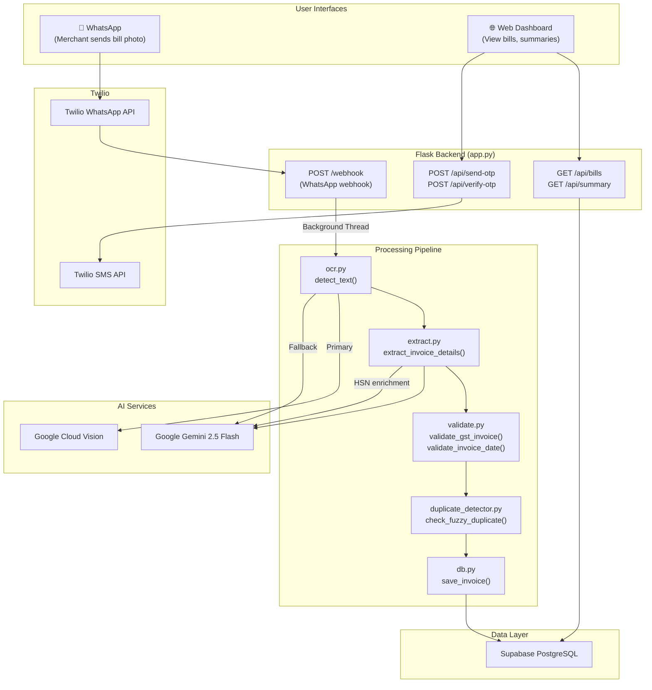
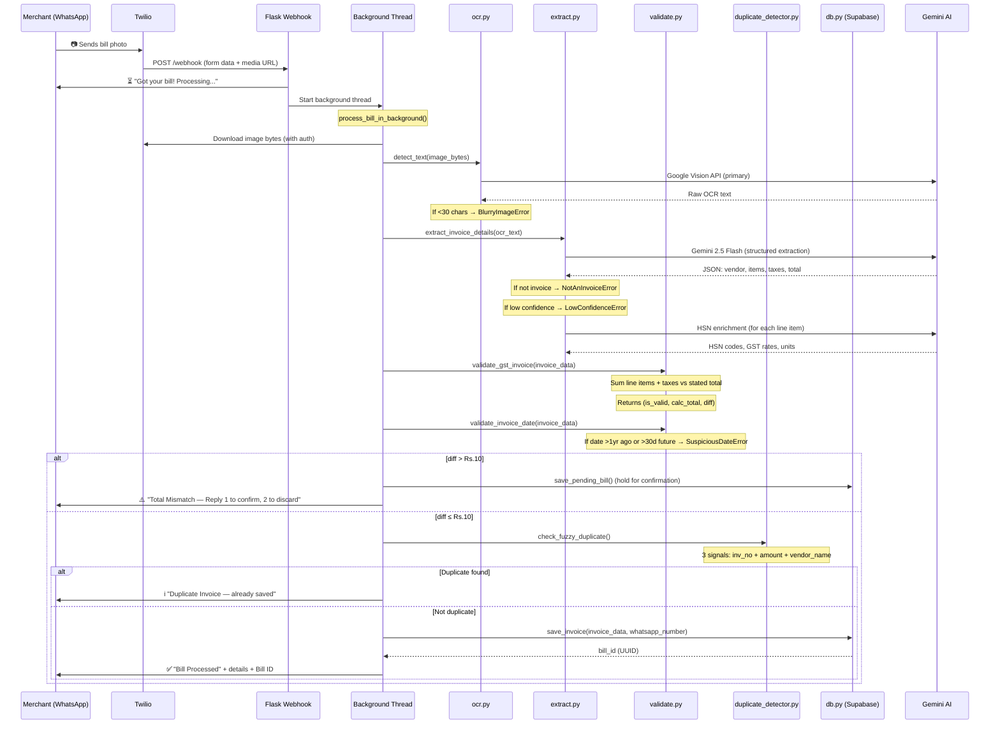
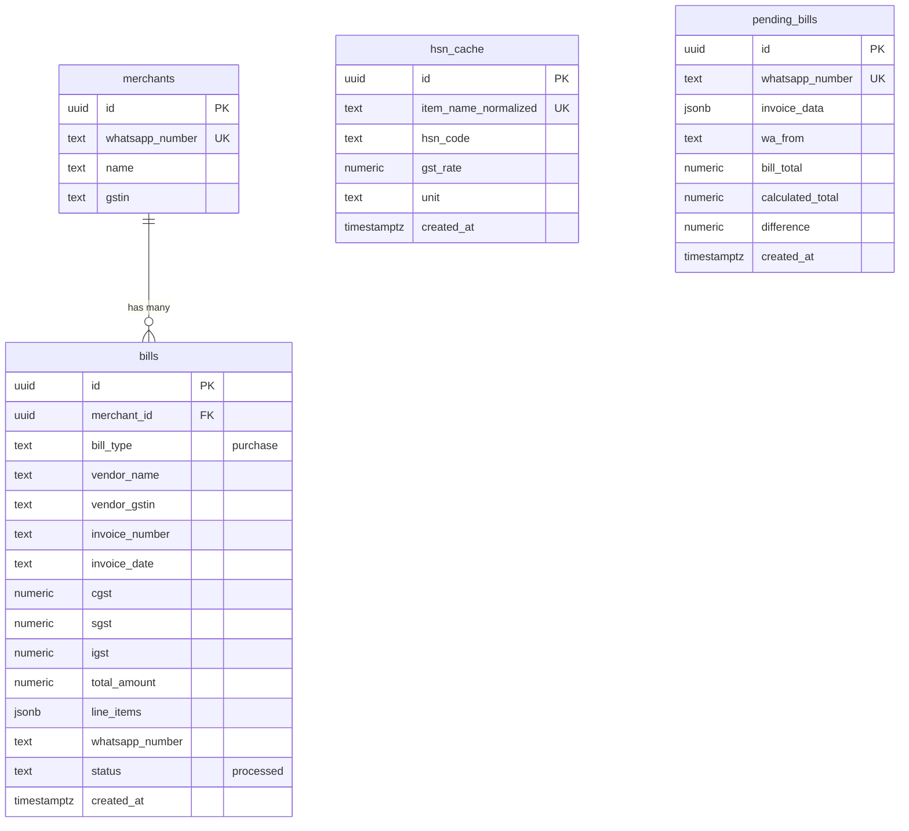

# GST ACT AI — Complete Project Report (Interview Ready)

> **Purpose**: This document is your single reference to explain every file, every function, and the full workflow of the GST ACT AI project to an interviewer. Open any file and use this guide to walk through the code confidently.

---

## 📋 Table of Contents

1. [Project Overview](#1-project-overview)
2. [Tech Stack & Services](#2-tech-stack--services)
3. [Architecture Diagram](#3-architecture-diagram)
4. [Complete File Map](#4-complete-file-map)
5. [Core Pipeline: Photo → Save](#5-core-pipeline-photo--save)
6. [File-by-File Deep Dive](#6-file-by-file-deep-dive)
7. [Database Schema](#7-database-schema)
8. [API Endpoints Reference](#8-api-endpoints-reference)
9. [Dashboard (Purchase Bills)](#9-dashboard-purchase-bills)
10. [Error Handling & Edge Cases](#10-error-handling--edge-cases)
11. [Test Suite](#11-test-suite)
12. [Deployment & DevOps](#12-deployment--devops)
13. [Interview Q&A Cheat Sheet](#13-interview-qa-cheat-sheet)

---

## 1. Project Overview

**GST ACT AI** is a full-stack AI-powered application that helps Indian small-business merchants digitize their GST (Goods & Services Tax) purchase bills via WhatsApp and view organized summaries through a web dashboard.

### What It Does

| Feature | How It Works |
|---|---|
| **Purchase Bill Tracker** (WhatsApp Bot) | Merchant sends a photo of a GST bill on WhatsApp → AI reads it → Extracts structured data → Validates → Saves to database → Sends confirmation back |
| **Web Dashboard** | Merchant logs in with OTP → Views all saved bills → Sees monthly GST summaries with trend charts → Drills into individual bill details |

### Key Value Propositions
- **Zero data entry** — AI reads the bill photo automatically
- **WhatsApp native** — no app download needed, merchants use what they already have
- **Duplicate detection** — fuzzy matching prevents double-entry even with OCR errors
- **Math validation** — catches incorrect totals before saving
- **Date validation** — catches OCR date errors (e.g., "2018" misread from "2026")
- **HSN code enrichment** — AI-powered HSN code lookup enriches extracted line items with missing HSN codes, GST rates, and units
- **Monthly GST summaries** — instant tax breakdown via WhatsApp or dashboard

---

## 2. Tech Stack & Services

| Layer | Technology | Purpose |
|---|---|---|
| **Backend** | Python + Flask | Web framework, API server |
| **AI — OCR** | Google Cloud Vision API | Primary OCR engine (reads text from bill images) |
| **AI — Fallback OCR** | Google Gemini 2.5 Flash | Fallback OCR if Vision API fails |
| **AI — Extraction** | Google Gemini 2.5 Flash | Understands OCR text and extracts structured invoice fields |
| **AI — HSN Lookup** | Google Gemini 2.5 Flash | Determines HSN codes, GST rates for line items |
| **Messaging** | Twilio WhatsApp API | Receives/sends WhatsApp messages |
| **SMS** | Twilio SMS API | Sends OTP for dashboard login |
| **Database** | Supabase (PostgreSQL) | Stores merchants, bills, HSN cache, pending bills |
| **Frontend** | Vanilla HTML/CSS/JS | Dashboard UI |
| **Deployment** | Azure App Service | Production hosting |
| **WSGI Server** | Gunicorn | Production server (2 workers, 4 threads) |

### Environment Variables ([.env.example](file:///c:/Users/abcom/Desktop/GST_ACT_AI/.env.example))

```
GEMINI_API_KEY          → Google Gemini AI (extraction + fallback OCR + HSN lookup)
GOOGLE_VISION_API_KEY   → Google Cloud Vision (primary OCR)
TWILIO_ACCOUNT_SID      → Twilio account
TWILIO_AUTH_TOKEN        → Twilio auth
TWILIO_WHATSAPP_NUMBER  → Twilio WhatsApp sandbox number
TWILIO_SMS_NUMBER       → (Optional) Twilio SMS number for OTP
SUPABASE_URL            → Supabase project URL
SUPABASE_KEY            → Supabase anon key
DASHBOARD_URL           → (Optional) Public URL shown in WhatsApp messages
```

---

## 3. Architecture Diagram



---

## 4. Complete File Map

### Root-Level Python Files (The Core)

| File | Lines | Purpose |
|---|---|---|
| [app.py](file:///c:/Users/abcom/Desktop/GST_ACT_AI/app.py) | 795 | **Main entry point** — Flask app, WhatsApp webhook, Dashboard API, OTP auth |
| [ocr.py](file:///c:/Users/abcom/Desktop/GST_ACT_AI/ocr.py) | 144 | **Step 1** — OCR (Google Vision → Gemini fallback) |
| [extract.py](file:///c:/Users/abcom/Desktop/GST_ACT_AI/extract.py) | 281 | **Step 2** — AI extraction (Gemini) + HSN enrichment |
| [validate.py](file:///c:/Users/abcom/Desktop/GST_ACT_AI/validate.py) | 173 | **Step 3** — Math validation + Date validation |
| [duplicate_detector.py](file:///c:/Users/abcom/Desktop/GST_ACT_AI/duplicate_detector.py) | 120 | **Step 4** — Fuzzy duplicate detection (3-signal matching) |
| [db.py](file:///c:/Users/abcom/Desktop/GST_ACT_AI/db.py) | 353 | **Step 5** — Database operations (Supabase), merchant management, pending bills |
| [exceptions.py](file:///c:/Users/abcom/Desktop/GST_ACT_AI/exceptions.py) | 69 | Custom exception classes for the pipeline |

### Dashboard (Purchase Bills) — `dashboard/`

| File | Purpose |
|---|---|
| [index.html](file:///c:/Users/abcom/Desktop/GST_ACT_AI/dashboard/index.html) | Main SPA — login, summary cards, bills table, bill detail modal |
| [js/data.js](file:///c:/Users/abcom/Desktop/GST_ACT_AI/dashboard/js/data.js) | API layer — all fetch calls to Flask backend |
| [js/app.js](file:///c:/Users/abcom/Desktop/GST_ACT_AI/dashboard/js/app.js) | UI logic — renders views, handles navigation, chart rendering |
| [css/style.css](file:///c:/Users/abcom/Desktop/GST_ACT_AI/dashboard/css/style.css) | Full CSS for dashboard with dark theme, glassmorphism |

### Config & Deployment

| File | Purpose |
|---|---|
| [requirements.txt](file:///c:/Users/abcom/Desktop/GST_ACT_AI/requirements.txt) | Python dependencies |
| [migration.sql](file:///c:/Users/abcom/Desktop/GST_ACT_AI/migration.sql) | Database migration script for Supabase |
| [startup.sh](file:///c:/Users/abcom/Desktop/GST_ACT_AI/startup.sh) | Azure App Service startup script |
| [startup.txt](file:///c:/Users/abcom/Desktop/GST_ACT_AI/startup.txt) | Gunicorn command for Azure |
| [.env.example](file:///c:/Users/abcom/Desktop/GST_ACT_AI/.env.example) | Template for environment variables |
| [.gitignore](file:///c:/Users/abcom/Desktop/GST_ACT_AI/.gitignore) | Git exclusion rules |

### Tests — `tests/`

| File | What It Tests |
|---|---|
| [test_date_validation.py](file:///c:/Users/abcom/Desktop/GST_ACT_AI/tests/test_date_validation.py) | Date parsing (8 formats) + suspicious date detection |
| [test_duplicate_detector.py](file:///c:/Users/abcom/Desktop/GST_ACT_AI/tests/test_duplicate_detector.py) | Fuzzy duplicate detection (invoice number, amount, vendor name) |
| [test_hsn_cache.py](file:///c:/Users/abcom/Desktop/GST_ACT_AI/tests/test_hsn_cache.py) | HSN cache write/read/miss/enrichment (integration test) |
| [test_gemini.py](file:///c:/Users/abcom/Desktop/GST_ACT_AI/tests/test_gemini.py) | Gemini API connectivity |
| [test_supabase.py](file:///c:/Users/abcom/Desktop/GST_ACT_AI/tests/test_supabase.py) | Supabase connectivity |
| [test_twilio.py](file:///c:/Users/abcom/Desktop/GST_ACT_AI/tests/test_twilio.py) | Twilio API connectivity |
| [test_vision.py](file:///c:/Users/abcom/Desktop/GST_ACT_AI/tests/test_vision.py) | Google Cloud Vision API connectivity |

---

## 5. Core Pipeline: Photo → Save

This is the **most important workflow** to explain in an interview. When a merchant sends a bill photo on WhatsApp:



### Why Background Thread?

Twilio requires the webhook to respond within **15 seconds** or it times out. The full pipeline (OCR + AI extraction + validation + DB save) takes 5-15 seconds. So:
1. **Immediately** return a TwiML ACK: *"⏳ Got your bill! Processing..."*
2. Spawn a `threading.Thread` for the heavy work
3. When done, send the result via Twilio's **outbound API** (`send_whatsapp()`)

---

## 6. File-by-File Deep Dive

### 6.1 [app.py](file:///c:/Users/abcom/Desktop/GST_ACT_AI/app.py) — The Main Entry Point (795 lines)

**What it does**: Connects everything together. Handles WhatsApp webhook, Dashboard API, and OTP authentication.

#### Key Sections:

| Section | Lines | What It Does |
|---|---|---|
| **Imports & Config** | 1-78 | Loads env vars, initializes Twilio client, sets up Flask, OTP store |
| **Helpers** | 84-176 | `fmt_inr()` — Indian currency formatting; `normalise_phone()` — E.164 phone normalization; `send_sms_otp()` — Twilio SMS; `send_whatsapp()` — Twilio outbound; `twiml_ack()` — instant TwiML response; `download_media()` — downloads WhatsApp image |
| **process_bill_in_background()** | 183-323 | The core pipeline: OCR → Extract → Validate → Save. Handles all exception types |
| **Dashboard API Routes** | 326-591 | REST APIs: send-otp, verify-otp, get-bills, get-single-bill, get-summary, whatsapp-info |
| **WhatsApp Webhook** | 597-783 | `POST /webhook` — handles incoming messages: "1" (confirm), "2" (discard), "CONFIRM DATE", "SUMMARY", photo, text |
| **Entry Point** | 789-795 | `if __name__ == "__main__"` — starts Flask dev server on port 5000 |

#### Key Functions to Explain:

**`process_bill_in_background(whatsapp_number, media_url, wa_from)`** ([Lines 183-323](file:///c:/Users/abcom/Desktop/GST_ACT_AI/app.py#L183-L323))
- The heart of the app. Called in a daemon thread.
- Downloads image → OCR → Extract → Validate (math + date) → Duplicate check → Save
- **Math validation gate** (Lines 200-228): If `diff > Rs.10` between our calculated total and the bill's stated total, saves to `pending_bills` table and asks merchant to confirm (reply "1") or discard (reply "2")
- Catches 5 specific exceptions with user-friendly WhatsApp responses
- Sends item-wise GST details in **chunked messages** (max 1500 chars per message to avoid WhatsApp limits)

**`webhook()`** ([Lines 607-783](file:///c:/Users/abcom/Desktop/GST_ACT_AI/app.py#L607-L783))
- Receives WhatsApp messages via Twilio's webhook
- **Decision tree**:
  - Body == "1" → Confirm pending bill (math-validation)
  - Body == "2" → Discard pending bill
  - Body == "CONFIRM DATE" → Confirm suspicious date
  - Body == "SUMMARY" → Return monthly GST summary (inline, no background thread)
  - No media → Send welcome/instructions
  - Wrong file type → Reject (only accepts images)
  - Image → ACK immediately, process in background thread

**`api_get_summary()`** ([Lines 494-571](file:///c:/Users/abcom/Desktop/GST_ACT_AI/app.py#L494-L571))
- **Optimized**: Single Supabase query fetches all bills from last 6 months
- Processes monthly trend **in-memory** instead of 6 separate DB queries
- Returns current month summary + 6-month trend data for charts

---

### 6.2 [ocr.py](file:///c:/Users/abcom/Desktop/GST_ACT_AI/ocr.py) — Step 1: OCR (144 lines)

**What it does**: Takes bill image bytes, returns raw text.

#### Key Functions:

**`detect_text(image_bytes)`** ([Lines 59-91](file:///c:/Users/abcom/Desktop/GST_ACT_AI/ocr.py#L59-L91))
- **Primary**: Google Cloud Vision API (`perform_vision_ocr`)
- **Fallback**: Gemini 2.5 Flash multimodal OCR (`perform_gemini_ocr`)
- **Quality gate**: If extracted text < 30 characters → raises `BlurryImageError`
- **Why two engines?** Vision API is faster/cheaper but may fail if API key isn't set. Gemini can read images natively as a fallback.

**`perform_vision_ocr(image_bytes)`** ([Lines 18-36](file:///c:/Users/abcom/Desktop/GST_ACT_AI/ocr.py#L18-L36))
- Uses `google.cloud.vision.ImageAnnotatorClient` with API key auth
- Returns `text_annotations[0].description` (full block of text)

**`perform_gemini_ocr(image_bytes)`** ([Lines 38-57](file:///c:/Users/abcom/Desktop/GST_ACT_AI/ocr.py#L38-L57))
- Converts bytes to PIL Image
- Sends image + prompt to `gemini-2.5-flash` model
- Prompt: *"Perform OCR on this image. Extract and transcribe all text exactly as it appears."*

> **Interview Tip**: The fallback pattern is a real-world reliability pattern. If the primary service fails, the system degrades gracefully rather than failing completely.

---

### 6.3 [extract.py](file:///c:/Users/abcom/Desktop/GST_ACT_AI/extract.py) — Step 2: AI Extraction (281 lines)

**What it does**: Takes raw OCR text, returns structured JSON using Gemini AI, and enriches line items with HSN codes.

#### Key Functions:

**`extract_invoice_details(ocr_text)`** ([Lines 97-203](file:///c:/Users/abcom/Desktop/GST_ACT_AI/extract.py#L97-L203))
- Sends OCR text to Gemini 2.5 Flash with a detailed extraction prompt
- Uses `response_mime_type: "application/json"` to force JSON output
- Extracts: `vendor_name`, `vendor_gstin`, `invoice_number`, `invoice_date`, `cgst`, `sgst`, `igst`, `total_amount`, `line_items[]`
- **Three safety gates**:
  1. `is_invoice == false` → raises `NotAnInvoiceError` (photo is not a bill)
  2. `low_confidence == true` → raises `LowConfidenceError` (handwritten, carbon copy, multi-rate)
  3. All fields empty → raises `NotAnInvoiceError`
- **HSN Cache Enrichment** (Lines 184-201): For each line item, calls `lookup_hsn_for_item()` to backfill missing `hsn_sac`, `gst_rate`, and `unit` fields. Only backfills — never overwrites values already found on the bill.

**`lookup_hsn_for_item(description)`** ([Lines 20-94](file:///c:/Users/abcom/Desktop/GST_ACT_AI/extract.py#L20-L94))
- **Cache-first strategy**:
  1. Check Supabase `hsn_cache` table (fast, free)
  2. On miss: Call Gemini AI to infer the HSN code, GST rate, and unit of measure
  3. Save result to cache for future lookups
- Returns `{hsn_code, gst_rate, unit}`
- Failures are non-fatal (returns `None` values)

> **Interview Tip**: This is a **cache-aside pattern**. The caching prevents repeated expensive API calls for common items like "Plywood Sheet" or "Cement Bag".

---

### 6.4 [validate.py](file:///c:/Users/abcom/Desktop/GST_ACT_AI/validate.py) — Step 3: Validation (173 lines)

**What it does**: Validates extracted data for mathematical correctness and date sanity.

#### Key Functions:

**`validate_gst_invoice(invoice_data)`** ([Lines 82-125](file:///c:/Users/abcom/Desktop/GST_ACT_AI/validate.py#L82-L125))
- Sums all `line_items[].amount` to get `calculated_subtotal`
- Adds `CGST + SGST + IGST` to get `calculated_total`
- Compares against `total_amount` from the bill
- Returns `(is_valid, calculated_total, difference)`
- **Does NOT block** — always returns `is_valid=True`. The caller (app.py) decides the threshold (Rs.10)
- **Why?** Bills often include freight, packing, rounding charges that are not line items

**`validate_invoice_date(invoice_data)`** ([Lines 39-79](file:///c:/Users/abcom/Desktop/GST_ACT_AI/validate.py#L39-L79))
- Parses date using 8 common Indian date formats
- Flags if date is >365 days old or >30 days in the future
- Raises `SuspiciousDateError` → triggers human-in-the-loop confirmation
- **Real scenario**: OCR sometimes reads "2018" instead of "2026" on a printed bill

**`parse_invoice_date(date_str)`** ([Lines 23-36](file:///c:/Users/abcom/Desktop/GST_ACT_AI/validate.py#L23-L36))
- Tries 8 date formats: `YYYY-MM-DD`, `DD-MM-YYYY`, `DD/MM/YYYY`, `DD.MM.YYYY`, `Month DD, YYYY`, etc.
- Returns `None` if unparseable (doesn't block the pipeline)

---

### 6.5 [duplicate_detector.py](file:///c:/Users/abcom/Desktop/GST_ACT_AI/duplicate_detector.py) — Step 4: Fuzzy Duplicate Detection (120 lines)

**What it does**: Detects if the same bill was already uploaded, even with OCR errors.

#### The Three-Signal Matching Logic:

All three must match to flag a duplicate:

| Signal | Method | Threshold |
|---|---|---|
| 1. Invoice Number | Normalized exact match (strip `/`, `-`, spaces, uppercase) | Exact |
| 2. Total Amount | Exact match (no tolerance) | `==` |
| 3. Vendor Name | `difflib.SequenceMatcher` similarity ratio | > 80% |

#### Key Functions:

**`check_fuzzy_duplicate(client, invoice_number, total_amount, vendor_name, whatsapp_number)`** ([Lines 56-119](file:///c:/Users/abcom/Desktop/GST_ACT_AI/duplicate_detector.py#L56-L119))
- Fetches all existing bills for the merchant from Supabase
- Loops through each, applying all 3 signals
- Returns `(existing_bill_id, existing_invoice_date)` or `None`

**`normalize_invoice_number(inv_no)`** ([Lines 21-29](file:///c:/Users/abcom/Desktop/GST_ACT_AI/duplicate_detector.py#L21-L29))
- `"PDP/26-27/026"` → `"PDP2627026"` (strips all non-alphanumeric, uppercases)
- Makes `PDP26-27-026`, `PDP/26-27/026`, `PDP26-27/026` all equivalent

**`vendor_name_similarity(name_a, name_b)`** ([Lines 32-43](file:///c:/Users/abcom/Desktop/GST_ACT_AI/duplicate_detector.py#L32-L43))
- Case-insensitive, whitespace-normalized
- Uses `SequenceMatcher` ratio (0.0 to 1.0)
- **Real scenario**: OCR reads "Fooja" instead of "Pooja" → 96% similarity → still caught as duplicate

> **Interview Tip**: This is the most interesting engineering decision. Why not use just invoice number? Because OCR can mangle characters. Why not add amount tolerance? Because two genuinely different invoices from the same vendor could have similar amounts. The **three-signal AND logic** minimizes both false positives and false negatives.

---

### 6.6 [db.py](file:///c:/Users/abcom/Desktop/GST_ACT_AI/db.py) — Step 5: Database Operations (353 lines)

**What it does**: All Supabase interactions for purchase bills and supporting features.

#### Key Functions:

**`save_invoice(invoice_data, whatsapp_number)`** ([Lines 207-263](file:///c:/Users/abcom/Desktop/GST_ACT_AI/db.py#L207-L263))
- **Step 1**: `get_or_create_merchant()` — lookup by WhatsApp number, create if new
- **Step 2**: Build bill record with all fields
- **Step 3**: `check_fuzzy_duplicate()` — raises `DuplicateInvoiceError` if found
- **Step 4**: Insert into `bills` table, return UUID bill_id

**`get_or_create_merchant(client, whatsapp_number, vendor_name, vendor_gstin)`** ([Lines 180-203](file:///c:/Users/abcom/Desktop/GST_ACT_AI/db.py#L180-L203))
- Looks up merchant by WhatsApp number
- If not found, creates a new entry
- Returns merchant UUID

**`get_monthly_summary(whatsapp_number)`** ([Lines 265-308](file:///c:/Users/abcom/Desktop/GST_ACT_AI/db.py#L265-L308))
- Queries bills for current calendar month
- Sums CGST, SGST, IGST, and total_amount
- Used by the WhatsApp "SUMMARY" command

**Pending Bills Functions** ([Lines 102-176](file:///c:/Users/abcom/Desktop/GST_ACT_AI/db.py#L102-L176)):
- `save_pending_bill()` — upserts to `pending_bills` table (whatsapp_number is conflict key)
- `get_pending_bill()` — fetches + checks 10-minute expiry
- `delete_pending_bill()` — removes after confirm/reject

**HSN Cache Functions** ([Lines 14-81](file:///c:/Users/abcom/Desktop/GST_ACT_AI/db.py#L14-L81)):
- `get_hsn_from_cache()` — lookup by normalized item name
- `save_hsn_to_cache()` — upsert with conflict handling
- `_normalize_item_name()` — lowercase, strip punctuation, collapse whitespace

---

### 6.7 [exceptions.py](file:///c:/Users/abcom/Desktop/GST_ACT_AI/exceptions.py) — Custom Exceptions (69 lines)

| Exception | Raised By | User Gets |
|---|---|---|
| `BlurryImageError` | `ocr.py` (text < 30 chars) | "📷 Photo Too Blurry" |
| `NotAnInvoiceError` | `extract.py` (not a bill) | "🚫 Not a GST Bill" |
| `LowConfidenceError` | `extract.py` (handwritten, multi-rate) | "⚠️ Unable to process completely" |
| `DuplicateInvoiceError` | `db.py` (fuzzy match found) | "ℹ️ Duplicate Invoice — already saved" |
| `SuspiciousDateError` | `validate.py` (date out of range) | "⚠️ Date Verification Required — reply CONFIRM DATE" |

> **Design Decision**: All exceptions are centralized in one file so every module imports from the same place. Each exception carries the data needed for the user-facing message (e.g., `DuplicateInvoiceError` carries `existing_bill_id` and `existing_invoice_date`).

---

### 6.8 [migration.sql](file:///c:/Users/abcom/Desktop/GST_ACT_AI/migration.sql) — Database Schema (68 lines)

This SQL is run in the Supabase SQL Editor to set up the database. Key operations:

1. **Extends `bills` table** with additional columns (`bill_type`, `status`, etc.)
2. **Extends `merchants` table** with business profile fields (`business_name`, `business_gstin`, `business_address`, etc.)
3. **Creates `hsn_cache` table** — caches AI HSN lookups (unique on `item_name_normalized`)
4. **Creates `pending_bills` table** — holds invoices awaiting merchant math-validation confirmation (unique on `whatsapp_number`)
5. **Creates indexes** for performance (`bills.bill_type`, `bills.whatsapp_number+bill_type`, `hsn_cache.item_name_normalized`)

---

## 7. Database Schema



### Key Design Decisions:
- **`line_items` stored as JSONB** — flexible schema for varying numbers of items per bill
- **`pending_bills` has UNIQUE on `whatsapp_number`** — each merchant has at most one pending bill at a time (new photo replaces old pending)
- **`hsn_cache` has UNIQUE on `item_name_normalized`** — prevents duplicate cache entries

---

## 8. API Endpoints Reference

### WhatsApp Webhook

| Method | Endpoint | Purpose |
|---|---|---|
| `GET` | `/` | Health check — returns `{"status": "active"}` |
| `POST` | `/webhook` | Twilio WhatsApp webhook — receives all messages |

### Dashboard APIs (Purchase Bills)

| Method | Endpoint | Purpose |
|---|---|---|
| `POST` | `/api/send-otp` | Send 6-digit OTP via SMS |
| `POST` | `/api/verify-otp` | Verify OTP, return session token |
| `GET` | `/api/bills?phone=...&month=...` | All purchase bills (with optional month filter) |
| `GET` | `/api/bills/<id>?phone=...` | Single bill with full line_items |
| `GET` | `/api/summary?phone=...` | Monthly summary + 6-month trend |
| `GET` | `/api/whatsapp-info` | Twilio WhatsApp number + wa.me link |
| `GET` | `/dashboard/` | Serve dashboard HTML |

---

## 9. Dashboard (Purchase Bills)

### [dashboard/js/data.js](file:///c:/Users/abcom/Desktop/GST_ACT_AI/dashboard/js/data.js) — API Layer (124 lines)

- **`API_BASE`** auto-detects: same origin in production, `localhost:5000` in file:// mode
- **`SESSION`** object persists to `localStorage` (phone, token, name)
- **Utility functions**: `fmtINR()` (Indian ₹ formatting), `fmtDate()` (human-friendly dates)
- **API functions**: `apiSendOtp()`, `apiVerifyOtp()`, `apiFetchBills()`, `apiFetchBill()`, `apiFetchSummary()`, `apiFetchWhatsappInfo()`

### [dashboard/js/app.js](file:///c:/Users/abcom/Desktop/GST_ACT_AI/dashboard/js/app.js) — UI Logic (37,629 bytes)

- SPA with views: Login, Dashboard (summary cards + 6-month trend chart + bills table), Bill Detail modal
- OTP login flow with dev bypass (`000000`)
- Month filter for bills
- Responsive design

### [dashboard/css/style.css](file:///c:/Users/abcom/Desktop/GST_ACT_AI/dashboard/css/style.css) — Styling (35,413 bytes)

- Dark theme with glassmorphism
- Responsive layout
- Animations and transitions

---

## 10. Error Handling & Edge Cases

### Human-in-the-Loop Flows

The app has **two confirmation flows** where AI is uncertain and asks the merchant:

#### 1. Math Validation Confirmation (Lines 200-228 in app.py)
- **Trigger**: `abs(calculated_total - bill_total) > Rs.10`
- **Why it happens**: Bills often include freight/packing charges not listed as line items
- **Flow**: Bill → pending_bills table → WhatsApp message with mismatch details → Merchant replies "1" (save) or "2" (discard)
- **Expiry**: 10 minutes

#### 2. Date Validation Confirmation (Lines 286-304 in app.py)
- **Trigger**: Invoice date >365 days old or >30 days in the future
- **Why it happens**: OCR misreads year digits (e.g., "2018" instead of "2026")
- **Flow**: Bill → in-memory `_pending_bills` dict → WhatsApp message → Merchant replies "CONFIRM DATE"
- **Expiry**: 10 minutes

### Error Handling Strategy

```
try:
    full pipeline...
except BlurryImageError:     → "📷 Photo Too Blurry"
except NotAnInvoiceError:    → "🚫 Not a GST Bill"
except LowConfidenceError:   → "⚠️ Unable to process"
except SuspiciousDateError:  → "⚠️ Date Verification Required" (human-in-the-loop)
except DuplicateInvoiceError:→ "ℹ️ Duplicate Invoice"
except Exception:            → "❌ Processing Failed" (generic fallback)
```

### Dev Mode vs Production

- **Dev mode** (`DEV_MODE = True` when no `TWILIO_SMS_NUMBER` is set):
  - OTP is returned in the API response (no SMS sent)
  - OTP bypass: `000000` always accepted
  - WhatsApp messages print to console instead of sending

---

## 11. Test Suite

### [test_date_validation.py](file:///c:/Users/abcom/Desktop/GST_ACT_AI/tests/test_date_validation.py) (156 lines, 12 tests)

Tests `parse_invoice_date()` and `validate_invoice_date()`:
- 8 date format parsing tests (ISO, Indian DD-MM-YYYY, DD/MM/YYYY, dots, month names)
- Recent date passes, today passes
- OCR error "2018" is flagged
- Date >1 year old is flagged
- Future date >30 days is flagged
- Near future passes
- Missing/unparseable dates don't block pipeline
- Uses `unittest.mock.patch` to mock `datetime.utcnow()` for deterministic tests

### [test_duplicate_detector.py](file:///c:/Users/abcom/Desktop/GST_ACT_AI/tests/test_duplicate_detector.py) (250 lines, 12 tests)

Tests all three signals:
- `normalize_invoice_number()` — strips slashes, dashes, spaces; case insensitive; equivalent formats
- `vendor_name_similarity()` — identical names (1.0), OCR error P→F (>80%), completely different (<80%)
- `amounts_match_exact()` — exact match only, even Rs.1 difference rejected
- `check_fuzzy_duplicate()` — exact duplicate flagged, OCR vendor name error flagged, different invoice allowed, name below threshold allowed, amount mismatch allowed, empty invoice number skips
- Uses `MagicMock` to mock Supabase client

### [test_hsn_cache.py](file:///c:/Users/abcom/Desktop/GST_ACT_AI/tests/test_hsn_cache.py) (238 lines, integration test)

7 test groups (runs against real Supabase):
1. Supabase connectivity (hsn_cache table exists)
2. Item name normalization
3. Cache WRITE
4. Cache READ (HIT)
5. Cache MISS → Gemini AI call → auto-saved
6. Second call is a cache HIT (faster, no API call)
7. Line-item HSN enrichment simulation

---

## 12. Deployment & DevOps

### Azure App Service Deployment

**[startup.sh](file:///c:/Users/abcom/Desktop/GST_ACT_AI/startup.sh)**:
```bash
cd /home/site/wwwroot
pip install -r requirements.txt
gunicorn --bind=0.0.0.0:8000 --timeout 120 --workers 2 --threads 4 app:app
```

- **Gunicorn** with 2 workers and 4 threads per worker (handles concurrent WhatsApp messages)
- **Timeout 120s** — generous for AI processing
- **.azure/** directory contains Azure deployment config

### [requirements.txt](file:///c:/Users/abcom/Desktop/GST_ACT_AI/requirements.txt) — Key Dependencies

| Package | Version | Purpose |
|---|---|---|
| google-generativeai | 0.8.6 | Gemini AI SDK |
| google-cloud-vision | 3.14.0 | Cloud Vision OCR |
| twilio | 9.10.9 | WhatsApp + SMS |
| supabase | 2.30.0 | Database |
| pillow | 12.2.0 | Image processing |
| requests | 2.34.2 | HTTP client |
| python-dotenv | 1.2.2 | Env var management |
| flask | 3.1.3 | Web framework |
| gunicorn | 23.0.0 | WSGI server |

---

## 13. Interview Q&A Cheat Sheet

### "Walk me through the architecture"

> "The app has two user interfaces — WhatsApp for purchase bill tracking and a web dashboard for viewing data and summaries. When a merchant sends a bill photo on WhatsApp, Twilio webhooks it to our Flask backend. We immediately ACK the webhook (Twilio has a 15-second timeout) and spawn a background thread. The pipeline is: OCR (Google Vision, with Gemini fallback) → AI extraction (Gemini 2.5 Flash) → Math validation → Date validation → Fuzzy duplicate detection → Save to Supabase. Results are sent back via Twilio's outbound API. The dashboard authenticates via OTP and fetches data from the same Supabase database."

### "Why a background thread instead of a task queue?"

> "For simplicity in a small-scale deployment. A proper production system would use Celery + Redis or Azure Functions. But threading.Thread with daemon=True works well here because: (a) the Gunicorn config uses threads=4, (b) each request spawns one thread that completes in 5-15 seconds, and (c) thread-safety isn't an issue because each thread operates on independent data (different WhatsApp number)."

### "How does duplicate detection work?"

> "It uses a three-signal AND logic. All three must match: (1) Invoice number — normalized exact match after stripping all punctuation, (2) Total amount — exact match, no tolerance, (3) Vendor name — >80% similarity using difflib.SequenceMatcher. This catches OCR errors like 'Fooja' vs 'Pooja' while preventing false positives from similar but different invoices."

### "What happens if the AI extracts wrong data?"

> "We have four safety layers: (1) Blurry image gate — OCR with <30 chars is rejected, (2) Not-an-invoice gate — Gemini itself flags non-invoices, (3) Math validation — if our calculated total differs by >Rs.10, we ask the merchant to confirm before saving, (4) Date validation — dates >1 year old or >30 days in the future trigger human confirmation. The merchant always has the final say."

### "How does the HSN caching work?"

> "Cache-aside pattern with Supabase. When we need an HSN code for an item like 'Plywood Sheet': first check the hsn_cache table (key: normalized item name). On cache hit, return immediately. On miss, call Gemini AI to infer the HSN code, GST rate, and unit, then save to cache. Second request for the same item is instant with no API call. This saves both latency and API costs."

### "What was the most challenging part?"

> "The fuzzy duplicate detection. The naive approach (exact invoice number match) missed duplicates when OCR mangled a character. But being too fuzzy caused false positives. The three-signal approach (invoice number + exact amount + vendor similarity >80%) hit the sweet spot — it catches real duplicates even with OCR errors, but different invoices from the same vendor aren't falsely flagged."

---

> [!TIP]
> **Before the interview**: Run through this document once, then open each file in your IDE and trace through the `process_bill_in_background()` function — that's the heart of the project and the most likely code walkthrough you'll be asked to do.
